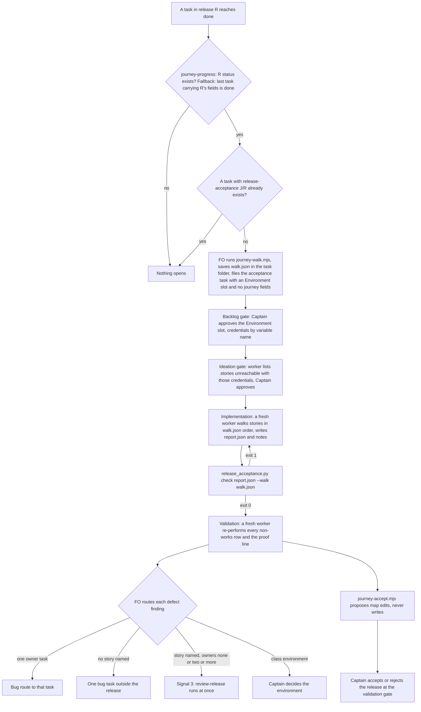
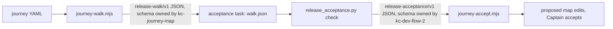

Issue iamcxa/kc-claude-plugins#571: a release is reviewed as one journey before its tasks are split, but nothing enforces that review, and nothing walks a release as a whole after its stories are built.

## Scope

Captain 2026-10-09 (qnow session), asking where the release-scale acceptance he had discussed lives: 「我們有討論過一個改進是，每個 release 應該要在故事都完成後，立一張票做 release scale 的驗收，目的是發現單獨故事做完之後是否仍有不可用的狀況，例如沒想到的問題，或是功能做完但流程不能走，沒有進入點...諸如此類，目前這個在哪裡？」; then 「可以」 to filing #571 and running the acceptance by hand on R3; 「照這樣核准。此外release 整版驗收要加入成為 workflow 的標準機制，應該加到哪個套件？」 (2026-10-10); then 「現在開」 to the FO's recommendation: the mechanism's main body in kc-dev-flow-2 (when the task opens, who walks, what the report carries, how failures route back to release review) paired with a kc-journey-map mode that produces the walk list from the map and takes the result back, joined by a declared contract, not shared code.
Evidence (copied into this task's folder): r3-acceptance.md (RELEASE 3 walk, 2026-10-09: found the office 確認 action off-screen at common laptop widths, which no single task's validation saw) and r4-acceptance.md (RELEASE 4 walk, 2026-10-10: R4's proof line could not be performed on staging until the opt-in operator secret was found; found the owner tab-bar icon font served as HTML).
Non-goals: rewriting the existing review-release mode; adopter-specific environments.
Budget and stop condition: to be set at ideation.

## Design

Base read: origin/main 2256b2288e8c15a1ecd2b7356859249d75b4d6f6 (`kc-dev-flow-2/references/sd/workflow.md` backlog bullet "Release review", `kc-journey-map/skills/kc-journey-map/references/release-review.md`, `kc-journey-map/lib/progress.mjs`, issue #571 read with `gh issue view 571`, 2026-10-10). Profile pilot holds: the mechanism adds a published upgrade consumers absorb, no production data, no credential held by the package, no recurring unattended operation.

### PRFAQ

**Press release (future).** A release is no longer finished when its last story task is done. A fresh worker walks the whole release on the hosted environment, story by story, in the map's order, and reports each story as works, broken, missing an entry point, or not reachable with the credentials given. A flow that crosses tasks goes back to release review at once. And an implementation can no longer start while a release the Captain changed has not been reviewed: the check refuses, and says which change is unreviewed.

**FAQ.**

- *What does the Captain get that he does not have today?* Today a release walk exists only because he asks (R3, R4 were hand-run, 2026-10-09 and 10-10), and the pre-implementation review is a prose line "no script checks" (workflow.md). After this: the walk opens by rule, and the review line is checked.
- *Why is the main body in kc-dev-flow-2?* Captain 2026-10-10: the mechanism's main body (when the task opens, who walks, what the report carries, how failures route back) is dev2's; kc-journey-map only produces the walk list and takes the result back.
- *Why is enforcement a script and not a refusal in `spacedock dispatch build`?* `dispatch build` belongs to Spacedock, a separate repository. Its `--help` (0.27.2) lists no precondition input, and `internal/dispatch/build.go` and `stamp.go` refuse only on their own conditions (entity path, status vs stage), so this package cannot add a refusal there. The issue's own alternative is "a package script the FO must run, with the same check". The package already has this pattern: the Seed check (`design_surfaces.py check --seed`) runs before `gate prepare`, and the worker's own check is the backstop.
- *What does the script not prove?* That a review was done well. It proves the line exists, has the right release and a plausible commit, and is newer than every recorded change. An FO that records no `Release changed:` line is not caught (named, not hidden).
- *Why does the acceptance task carry no `journey*` fields?* `findOrphans` in `progress.mjs` keys on journey+release+story; a task with journey and release but no story is listed as an orphan and `journey-progress.mjs` exits 1. The acceptance task names its release in its body and in one new frontmatter field, `release-acceptance: <journey>/<release-id>`, which no journey reader reads.
- *Cost?* Two PRs, no new CI job (both plugins already have a test workflow, `kc-dev-flow-2-tests.yml`, `kc-journey-map-tests.yml`). A walk is one fresh worker and one validation worker per release; the per-release token cost is not measured.

### Existing-code check (recorded conclusion)

- **Release review.** Journey: signal → mark → single checkpoint → `review-release`. Completeness: procedure only; workflow.md says "no script checks that line"; the archived design chose this on purpose ("advisory, named plainly"). Need: a falsifier exists now, R4 (issue #571 item 1: implementation dispatched with signals 1 and 2 recorded and no review). Decision: add a checker for the line; do not touch `review-release`.
- **Release acceptance.** Completeness: a display label only. `progress.mjs` sets `releases[].acceptance = 'pending delivery acceptance'` when every story is done, `records.mjs` draws it, `progress.test.mjs` asserts it; two bounded searches (`git grep -i "delivery acceptance"` and `git grep -i -E "release.{0,12}(acceptance|walk)|acceptance (task|walk)"` over kc-dev-flow-2 and kc-journey-map, CHANGELOGs excluded) found no consumer that opens work from it. Need: the Captain's request and the two hand walks. Decision: use that label as the trigger; build only the task, report and contract. Exclusions and unknowns: adopter repositories were not searched; adopters that track no completion (`journey-required-tasks` absent) cannot emit the label (see Captain decision 4).

### Part 1: kc-dev-flow-2 (the main body)

- **When it opens.** Trigger 1 (preferred): after any task in release R reaches `done`, FO runs `journey-progress.mjs <journey.yaml> --workflow-dir <dir>`; release R `status: exists` (its `acceptance` reads `pending delivery acceptance`) with no task carrying `release-acceptance: <journey>/<R>` opens one task. Trigger 2 (fallback, only where the adopter tracks no completion): the last task carrying `journey-release: R` reached `done`; the backlog gate then lists stories with no done task. Duplicate guard: `spacedock status --workflow-dir <dir> --archived --all-fields --json` shows the `release-acceptance` field (same mechanism `progress.mjs` already uses for the `journey*` fields).
- **The task.** Ordinary five-stage `pilot` task, slug `<release>-acceptance`, body `Acceptance of: <journey>/<R> at <journey-file commit>`, `Walk list: walk.json` (the snapshot FO produced, pinned to that commit), and an `Environment:` block (target, deployed ref, `<wrapper>` command, opt-in variable NAMES, test identities by role; never a value). It carries no `journey`, `journey-release` or `journey-story`.
- **Who walks.** A fresh worker dispatched without reuse (no `--advance`) in the implementation stage; validation is already `fresh: true`. FO checks that the walker's dispatch is not the worker of any story task in R; no script enforces this (procedure, named plainly). The walker starts from the persona's first situation in `walk.json` and, for each story, reaches it by navigation from where the previous story left the person, never from a URL handed to it. Failing to find a way in is the finding `missing entry point`.
- **What the report carries.** `report.json` (`release-acceptance/v1`, schema below) plus free notes beside it for observations. Per story: `works | broken | missing-entry-point | not-reachable`, the entry used, evidence file names, and finding ids. A `not-reachable` row needs a `cause` (R4's four rows: the operator API needed an opt-in secret the wrapper did not export). Then the proof line result (`performed | not-performed | failed`), findings, `not_tested`, `data_left`.
- **How failures route.** Per `defect` finding: exactly one owner task, route to that task; no story named (R4 C-2, icon font served as HTML), one bug task outside the release; a story named with zero or two-or-more owners (R4 C-3, nobody owns a path to a manager on the seeded branch), signal 3, so FO runs `review-release` at once (the existing workflow.md rule) and splits new tasks from its output. `known-gap` findings name the gap story on the map. `environment` findings go to the Captain. The walk worker triages nothing; FO triages (as for R3, "FO triage").
- **Validation.** A fresh worker re-performs every row that is not `works` and the proof line, and runs the check script. `works` rows are accepted on their cited evidence file and are not re-performed; that is the stated limit. The Captain's gate decision is the release acceptance.
- **Enforcing the pre-implementation review (second half of #571).** `scripts/release_review.py check <task> --workflow-dir <dir>`. Marks and reviews are lines in any task's `## FO alignment` (live or `_archive/`), at line start:
  `Release changed: <journey>/<release-id> signal <1|2> at <YYYY-MM-DDTHH:MMZ>: <reason>`
  `Release review: <journey>/<release-id> at <journey-file commit> on <YYYY-MM-DDTHH:MMZ>`
  The task's frontmatter `journey` and `journey-release` select the release; a task with neither is outside the check (exit 0, as the rule already says for bugs). The check exits 1 when the latest mark for that release is not older than the latest review (or no review exists), printing the marking task, signal and time; an unparsable time or a review commit that is not a hex SHA of 7 to 40 characters also exits 1, naming the file. `Release review: not needed: <reason>` stays as is. FO runs it before building the first implementation dispatch of a task in a release; the implementation skill runs it first on a cycle-1 dispatch and holds, quoting the output, on exit 1. The FO step is the gate; the worker step is the backstop for an FO that skipped it, as the Seed check's worker backstop does. A repair dispatch (cycle 2 and later) is not re-checked. Signal 3 needs no mark: it runs the review at once.
- **R4 as the failing case.** Fixture shape: release `r4` has task A in implementation-ready state; a `Release changed: ... signal 1` line sits in task A, a `signal 2` line sits in another task a few hours later; no review line. Today the FO dispatches (it did). With the check: exit 1 naming both marks. After a review line dated after both: exit 0. A later signal-2 mark: exit 1 again.

### Part 2: kc-journey-map (the mode)

- **Mode `accept-release`**, new row in the `SKILL.md` mode table and `references/accept-release.md`. It leaves `review-release` unchanged (Scope non-goal).
- **`lib/journey-walk.mjs <journey.yaml> <releaseId>`** prints `release-walk/v1` JSON. Stories are those with `release: <releaseId>`, ordered by step order then story order inside the step. `proof_line` is the release `goal`, verbatim (the same text `release-contract.mjs` prints); no new field. The map stores no URL or route, so the list gives each story's step `card` and `activity`, `status`, `evidence` symbol when present, the step's `system` lines and applicable `rules`; the walker finds the entry itself and the report says what it used. A map-level `entry` field is a Captain decision (6), not part of this design.
- **`lib/journey-accept.mjs <journey.yaml> <report.json>`** reads `release-acceptance/v1` and prints proposed map edits; it writes nothing (map-first, the Captain accepts, as `review-release` step 1 already requires). Rules, from `cell-contract.md` ("`exists` ... does not mean delivery acceptance"): `works` changes nothing, because acceptance is not a status and `exists` needs an evidence symbol; `broken` on a story whose status is `exists` proposes `unverified`; `missing-entry-point` on `exists` or `unverified` proposes `gap` (the contract's own rule: a handler with no route is `gap`); `not-reachable` changes nothing and its stories plus `not_tested` are proposed as the text of the status card's `unproven` line. It refuses (exit 1) a report whose schema string is not `release-acceptance/v1` or whose story ids are not all on the release.

### Part 3: the declared contract

Per the Captain's 2026-09-06 rule (plan / dev / ship connect only by declared input and output contracts, schemas live with the producer), neither plugin imports the other's files. Each side pins the other's schema string, refuses anything else, and tests against the example JSON that its own producer-side doc prints (so a doc edit that breaks the consumer fails a test).

`release-walk/v1` (documented in `accept-release.md`): `schema`, `journey`, `persona`, `one_journey`, `release{id,name,goal}`, `source{file,commit}`, `proof_line`, `stories[{order,id,card,step{id,card,activity},status,evidence,system[],rules[{id,text}]}]`.

`release-acceptance/v1` (documented in `kc-dev-flow-2/references/sd/release-acceptance.md`): `schema`, `walk{journey,release,source_commit}`, `target{environment,ref}`, `stories[{id,result,entry,evidence[],cause,findings[]}]`, `proof_line{result,evidence[],cause}`, `findings[{id,class,stories[],owners[],summary}]` with class one of `defect | known-gap | environment | by-design | not-defect`, `not_tested[]`, `data_left[]`.

`release_acceptance.py check <report.json> --walk <walk.json>` exits 1 when: a schema string differs; report journey/release/commit differ from the walk's; a walk story is missing, duplicated or unknown in the report; a result is outside the four; a `not-reachable` row has no `cause`; a non-`works` row names no finding; a `works` row has no evidence; a finding id is referenced but not defined; a `defect` has no `owners` key; the proof line is absent. On exit 0 it prints counts, one routing line per defect (`route: <owner>`, `route: bug task, no story`, `route: signal 3`), `Captain decision: environment` for an `environment` finding, and `clean: yes|no` (yes only when every story works, the proof line was performed and no `defect` remains). It decides nothing; the Captain accepts.

### Fixtures, and what they can and cannot show

The two hand walks (`r3-acceptance.md`, `r4-acceptance.md`) live in this task's folder, not in the public package, and name an adopter's staging host and shop data. The implementation copies their shape, not their text, into the package as synthetic fixtures on the `journey.example.yaml` book-pickup journey: R3-shape (9 stories: 8 works, 1 not-reachable by choice; one defect with one owner; one known gap; one not-defect; one by-design; proof performed), R4-morning-shape (6 stories: 2 works, 4 not-reachable with one cause; one environment finding; proof not-performed), R4-evening-shape (6 works; proof performed; one defect with no owner and a story, one defect with no story, one defect with one owner). The real qnow task files were not available to this ideation, so the R4 enforcement fixture is reconstructed from the issue text and `r4-acceptance.md`, not from the qnow tasks.

### ADR (draft, no number)

`docs/adr/`: "A release is accepted by walking it, and the two plugins meet only at two named schemas". Ruling: the walk list and the acceptance report are versioned JSON documents owned by their producers; no shared code; the map is changed only by a proposal the Captain accepts.

### Non-goals and limits

Not touched: `review-release`, Spacedock, any adopter environment or secret. Not claimed: that a worker obeys the cycle-1 check (instruction, covered by one live rehearsal, AC-5); that the walker was independent of the implementers (procedure); `works` rows are not re-walked at validation.

### Budget and stop condition (proposed; Scope left as the Captain wrote it)

Two PRs, one per plugin, either may merge first because the contract is pinned by string. Stop and return to FO if the work needs a third plugin file set, a Spacedock change, a second new frontmatter field, or a model-judged check inside a script.

## Acceptance criteria

**AC-1**: At the first implementation dispatch of a task in a release, a recorded `Release changed:` line newer than the latest `Release review:` line (or with no review) is refused with exit 1 naming the marking task, signal and time; a newer review line makes it pass; a later mark refuses again.
Source: issue #571 item 1 ("The FO dispatched that task's implementation without the signal-4 review"); Captain 「現在開」 2026-10-10.
Verified by: `python3 kc-dev-flow-2/scripts/test_release_review.py` builds the R4-shape state in a temp directory (task A with a signal 1 mark, another task with a signal 2 mark three hours later, no review) and asserts exit 1 with both marks named; appends a review line dated after both and asserts exit 0; appends a later mark and asserts exit 1. Falsifier: replacing the time comparison with "any review line exists" makes the third assertion fail.

**AC-2**: The check fails closed and stays out of the way: a task with no `journey` or `journey-release` exits 0; a release with no marks exits 0; an unparsable time, a missing release id, or a review commit that is not 7 to 40 hex characters exits 1 naming the file and line; a `Release changed:` line outside a `## FO alignment` section is ignored.
Source: workflow.md Release review ("a task with no release, such as a bug ... is outside it"); the ensign rule that a check refuses rather than guesses.
Verified by: the same test file, one case per bullet; the last case plants the grammar inside a task's `## Scope` and a fenced block and asserts exit 0.

**AC-3**: The check runs where this package can place it: workflow.md's Release review bullet names the FO step and the cycle-1 worker backstop, replacing "no script checks that line" with what the script does and does not prove.
Source: issue #571 ("a package script the FO must run, with the same check").
Verified by: `test_sd_dispatch.py` in a disposable repo extracts the command line from the workflow.md text and runs it against the AC-1 fixture (exit 1, then 0); `lint-skills.py` stays green. Limit: this proves the documented command works, not that an FO runs it.

**AC-4**: The implementation skill's cycle-1 instruction holds the worker when the check exits 1.
Source: same as AC-3; the Seed-check precedent (worker check as backstop).
Verified by: one live rehearsal, recorded in the implementation Stage Report: a disposable repository with the AC-1 fixture state and a dispatched implementation worker; the worker's report holds and quotes the check output; the same dispatch after the review line proceeds past the check. Limit: one model run, not a gate on every model.

**AC-5**: `journey-walk.mjs` prints `release-walk/v1` for one release of the book-pickup example: only that release's stories, step order then story order, `proof_line` equal to the release goal, and the same bytes on a second run.
Source: Captain 2026-10-10 (a mode that produces the walk list from the map); issue #571 ("along the journey map's story order").
Verified by: `node --test kc-journey-map/lib/journey-walk.test.mjs` on the example (r1 yields reserve-copy, check-ready, collect-book in that order); a mutated copy with two steps swapped yields the swapped order.

**AC-6**: `release_acceptance.py check` accepts the R3-shape report and routes it: the one-owner defect to its owner, the known gap to its gap story, 8 works, `clean: no`.
Source: `r3-acceptance.md` (results table, X-1 routed to a single task).
Verified by: `python3 kc-dev-flow-2/scripts/test_release_acceptance.py` asserts exit 0 and each of those output lines for the R3-shape fixture. Falsifier: deleting the `owners` entry of the defect makes it print `route: signal 3` instead.

**AC-7**: The R4-shape reports separate environment from defect and route cross-task holes to signal 3: the morning report (4 not-reachable, one cause) prints `Captain decision: environment` and `clean: no`; the evening report (6 works, proof performed) prints `route: signal 3` for the defect with a story and no owner, `route: bug task, no story` for the defect with no story, and `route: <owner>` for the one-owner defect.
Source: `r4-acceptance.md` (four "not reachable" rows, C-1, C-2, C-3); issue #571 item 2 ("A failure that crosses tasks feeds back into a release review (signal 3)"); Captain decision on the environment question below.
Verified by: the same test file, two fixtures, asserting those lines.

**AC-8**: A malformed report is refused: each of a schema string other than `release-acceptance/v1`, a walk story missing, a duplicate or unknown story, a result outside the four, a `not-reachable` row without `cause`, a non-works row naming no finding, a `works` row without evidence, an undefined finding id, a `defect` without `owners`, and an absent proof line exits 1 with its own message.
Source: the Captain's wording 「功能做完但流程不能走，沒有進入點」 requires every story to carry a result; the contract rule that consumers refuse unknown schemas.
Verified by: `test_release_acceptance.py`, one mutation of the R3-shape fixture per bullet, each asserting exit 1 and the message.

**AC-9**: `journey-accept.mjs` turns a report into map proposals only: on a map whose six stories are `exists`, a `broken` row proposes `unverified`, a `missing-entry-point` row proposes `gap`, `works` and `not-reachable` propose no status change, `not-reachable` stories and `not_tested` appear in the proposed `unproven` text; the journey file bytes are unchanged afterwards; a wrong schema string or a story not on the release exits 1.
Source: Captain 2026-10-10 ("takes the result back"); `cell-contract.md` ("`exists` ... does not mean delivery acceptance").
Verified by: `node --test kc-journey-map/lib/journey-accept.test.mjs` with a sha256 comparison of the YAML before and after.

**AC-10**: The acceptance task cannot become a journey orphan: with the task's frontmatter as specified (`release-acceptance` set, no `journey*` fields), `findOrphans` lists nothing; the same task with `journey` and `journey-release` set and no story is listed.
Source: `progress.mjs` `findOrphans` (journey-progress exits 1 on an orphan).
Verified by: a case in `kc-journey-map/lib/progress.test.mjs`. Limit: unit level; AC-11 covers the live listing.

**AC-11**: The trigger and its duplicate guard work on a real Spacedock listing: in a disposable workflow, `spacedock new <release>-acceptance` plus `status --set <task> release-acceptance=<journey>/<R>` makes `status --archived --all-fields --json` show the field, and the documented guard finds it; `journey-progress.mjs` on that workflow reports release R `acceptance: pending delivery acceptance` once all its story tasks are done.
Source: Captain 2026-10-09 ("每個 release 應該要在故事都完成後，立一張票做 release scale 的驗收").
Verified by: a scratch-workflow run recorded in the implementation Stage Report, in the style of the archived `release-review` rehearsal ("a scratch-workflow rehearsal ... `status --set`"). Not yet verified: whether Spacedock 0.27.2 keeps an unknown frontmatter field through `state commit`.

**AC-12**: The plugins stay joined only by the two documented schemas: neither imports files from the other plugin directory; each doc prints an example JSON that its consumer's test loads; `review-release` text is unchanged; both plugins pass the sanitize check with no adopter name, host or data in docs or fixtures; no version file is edited; the ADR passes `adr_lint.py`.
Source: Captain 2026-09-06 (contracts only, schemas with the producer); Scope non-goal ("rewriting the existing review-release mode"); repository rule on public plugins.
Verified by: an import-scan test in each plugin; `git diff --stat origin/main -- kc-journey-map/skills/kc-journey-map/references/release-review.md` empty; `Skill: kc-plugin-forge:kc-plugin-forge-sanitize-check kc-dev-flow-2` and `... kc-journey-map` clean; `python3 kc-dev-flow-2/scripts/adr_lint.py` exit 0; both existing CI suites green.

## Captain decisions

1. **Environment and credentials for the walk (the R4 question).** Recommend: the package defines only the slot (`Environment:` block with variable names, never values), FO fills it from the adopter's own documents, the Captain approves it at the acceptance task's backlog gate, and the ideation worker lists the stories that credentials do not reach before any walk starts; the adopter owns documenting its opt-in secret (R4 C-1). What gets worse: if the adopter documents nothing, the walk still stops at `not-reachable`, now at ideation instead of mid-walk.
2. **Result back to the map.** Recommend proposals only: downgrade `exists` on broken or no-entry stories, record `not-reachable` and `not_tested` on the status card's `unproven` line, and leave nothing on a story that works. What gets worse: a clean walk leaves no mark on the map, so "accepted" lives only in the validation gate record. The alternative is a new orthogonal story field; it fails the without-it test today.
3. **Enforcement by script, not by Spacedock.** Recommend the package script plus worker backstop now. What gets worse: an FO that records no `Release changed:` line is invisible to it. The alternative, a precondition input to `spacedock dispatch build`, needs a request to the Spacedock repository and a release of it; say if you want that filed.
4. **Trigger where an adopter tracks no completion.** Recommend the fallback (last task carrying the release's fields is done) with the backlog gate listing stories that have no done task. What gets worse: it can open early when a story has no task yet.
5. **Ideation for the acceptance task.** Recommend keeping it, as a short walk plan that checks the environment, because the five-stage route has no skip and R4's surprise is exactly what that stage catches. What gets worse: one more gate per release.
6. **Map-level entry points.** Recommend no new field now: the walker finds the entry and the report records it. What gets worse: a missing entry point is found by the walker, not read off the map.
7. **Budget and stop condition** as written under Design. Recommend accept.

## FO alignment

Release: none (package workflow change; kc-claude-plugins has no journey map).
Release review: not needed: no release.
Needed at ideation: the design of both halves (the kc-dev-flow-2 rule and task, the kc-journey-map mode) and the contract between them, against the existing Release review rule in kc-dev-flow-2 references/sd/workflow.md and kc-journey-map's review-release mode.
Surfaces: none
Visible change: none

## Stage Report: ideation

- DONE: Design (PRFAQ with Mermaid) for release-scale acceptance as a standard mechanism, per the Captain's ruling recorded in ## Scope: the kc-dev-flow-2 half (when the acceptance task opens, who walks it, what the report carries, how a cross-task failure routes back to release review as signal 3), the kc-journey-map half (a mode that produces the walk list: stories in order, entry points, the release proof line; and takes the result back to card status), and the declared contract between them, read against origin/main 2256b2288e8c15a1ecd2b7356859249d75b4d6f6 (kc-dev-flow-2 references/sd/workflow.md § Release review; kc-journey-map's review-release mode)
  `## Design` Parts 1-3 with two Mermaid diagrams (both rendered with mermaid-cli); the map carries no entry-point field, so the walk list gives step card and activity and the walker finds the entry (Captain decision 6).
- DONE: Issue #571's second half designed too: enforcing the pre-implementation release review at implementation dispatch, with the R4 instance (an implementation dispatched without the signal-4 review) as the failing case
  `release_review.py check` plus cycle-1 worker backstop; `spacedock dispatch build --help` (0.27.2) and `build.go`/`stamp.go` show no precondition input, so Spacedock-side refusal is Captain decision 3. The R4 fixture is reconstructed from the issue text, not the adopter's task files.
- DONE: Acceptance criteria with reproducible Verified-by clauses, each traceable to the Captain's words or the issue, using the two hand-run walks in this task's folder (r3-acceptance.md, r4-acceptance.md) as fixtures; and Captain decisions one per line with a recommendation, including the environment question the R4 walk raised (credentials the walk needs, such as an opt-in secret)
  12 criteria each with `Source:` and `Verified by:`; 7 Captain decisions, decision 1 is the environment question; walks are copied as shape-only synthetic fixtures (public repo).
- DONE: AC-1 refuse a newer unreviewed mark: not yet verified; `test_release_review.py` with the R4-shape state is implementation evidence.
  Current evidence: design only; grammar and exit rules specified under Part 1.
- DONE: AC-2 fail closed and out of the way: not yet verified; one test case per rule, implementation evidence.
  Current evidence: design only.
- DONE: AC-3 check placed at FO step and worker backstop in workflow.md: not yet verified; `test_sd_dispatch.py` extracts and runs the documented command.
  Current evidence: confirmed no Spacedock precondition input exists (`spacedock dispatch build --help`, 0.27.2).
- DONE: AC-4 cycle-1 worker holds on exit 1: not yet verified; needs one live rehearsal run.
  Current evidence: none; this is the only criterion that depends on model behavior.
- DONE: AC-5 walk list for one release in map order: not yet verified; `journey-walk.test.mjs`.
  Current evidence: read `journey.example.yaml`: r1 holds reserve-copy, check-ready, collect-book in step order.
- DONE: AC-6 R3-shape report routed: not yet verified; `test_release_acceptance.py`.
  Current evidence: `r3-acceptance.md` read (9 stories, 8 works, 1 not reachable, X-1 single owner).
- DONE: AC-7 R4-shape reports, environment vs defect vs signal 3: not yet verified; same test file.
  Current evidence: `r4-acceptance.md` read (morning 4 not-reachable rows, evening C-2 no story, C-3 no owner).
- DONE: AC-8 malformed report refused, ten mutations: not yet verified; same test file.
  Current evidence: design only.
- DONE: AC-9 map proposals only, bytes unchanged: not yet verified; `journey-accept.test.mjs`.
  Current evidence: `cell-contract.md` read: `exists` is not delivery acceptance; handler without route is `gap`.
- DONE: AC-10 acceptance task is not an orphan: not yet verified; case in `progress.test.mjs`.
  Current evidence: `findOrphans` in `progress.mjs` read: keyed on journey, release, story; a story-less task is an orphan.
- DONE: AC-11 trigger and duplicate guard on a real Spacedock listing: not yet verified; scratch-workflow run.
  Current evidence: `progress.mjs` already reads `journey*` fields via `status --all-fields`; whether `state commit` keeps the new `release-acceptance` field is unproven.
- DONE: AC-12 plugins joined only by two schemas, sanitize, ADR, unchanged review-release: not yet verified; import-scan tests, sanitize-check, `adr_lint.py`.
  Current evidence: docs/adr holds 0001-0009 (kc-journey-map's are 0006-0008); the draft ADR carries no number.
- DONE: Design surfaces check
  `python3 <package>/scripts/design_surfaces.py check index.md` exit 0: "index.md: design surfaces presentable" (Surfaces: none).

### Summary

The design puts the main body in kc-dev-flow-2 (acceptance task opened from the existing `pending delivery acceptance` label, a fresh walker, a `release-acceptance/v1` report, defect routing with signal 3 for cross-task holes, and a `release_review.py` check run by FO and as a worker backstop) and a kc-journey-map `accept-release` mode (`release-walk/v1` list out, map proposals back, never a write), joined by two producer-owned JSON schemas. Seven Captain decisions are listed with recommendations; decision 3 (script vs a Spacedock-side refusal) and decision 1 (environment slot and credentials) are the ones that change the shape. Limits: the R4 enforcement fixture is rebuilt from the issue text; the walker's independence and an FO that records no mark are procedure, not checked.
