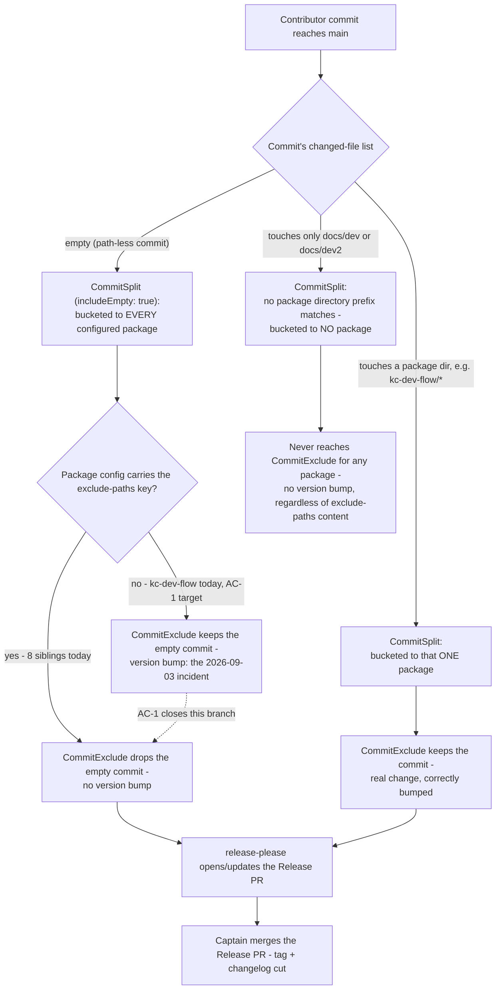

---
id:
title: release-please excludes workflow-state paths for every plugin
status: implementation
variant: kc-dev-flow-2
profile: prod
merge: pr
worktree: .worktrees/spacedock-ensign-release-please-exclude-paths
pr:
gates:
    version: 1
    records:
        - id: gate:release-please-exclude-paths:backlog
          stage: backlog
          attempts:
            - id: gate-attempt:release-please-exclude-paths-backlog-1
              briefing:
                id: briefing:release-please-exclude-paths:backlog:attempt-1:revision-1
                digest: sha256:cc5651b4964772c44a55ddeff8de95f71f5c450536eb581f23499da2b9174b2c
                room-ref: ./release-please-exclude-paths/review/backlog/briefing-1
              resolution:
                type: Resolution
                id: resolution:spacedock:release-please-exclude-paths:backlog:1
                briefing: briefing:release-please-exclude-paths:backlog:attempt-1:revision-1
                by: person:captain
                at: "2026-09-16T06:57:25.493101Z"
                decision: approve
                reason: Captain approved profile prod and the admission record's outcome, scope and exclusions.
              application:
                target-stage: ideation
                state: consumed
        - id: gate:release-please-exclude-paths:ideation
          stage: ideation
          attempts:
            - id: gate-attempt:release-please-exclude-paths-ideation-1
              briefing:
                id: briefing:release-please-exclude-paths:ideation:attempt-1:revision-1
                digest: sha256:57b89d55f0d274519220ea7c4414d3f10d58d6f707ed6010e4647634a2ba23eb
                room-ref: ./release-please-exclude-paths/review/ideation/briefing-1
              resolution:
                type: Resolution
                id: resolution:spacedock:release-please-exclude-paths:ideation:1
                briefing: briefing:release-please-exclude-paths:ideation:attempt-1:revision-1
                by: person:captain
                at: "2026-09-16T07:15:05.502068Z"
                decision: approve
                reason: 'Captain judged the ideation gate passed: design approved and scope narrowed to a single kc-dev-flow exclude-paths edit; docs/dev2 gains no entry.'
              application:
                target-stage: implementation
                state: consumed
started: 2026-09-16T07:15:47Z
---

A single empty commit to `main` once bumped all seven plugins minor with the same
changelog line, because release-please's manifest mode attributes a path-less commit
to every package. The repository's own `CLAUDE.md` records the fix and its unfinished
half: every plugin except `kc-dev-flow` carries `exclude-paths`, and `kc-dev-flow`
was to receive it "after `kc-dev-flow-v4.2.0` is tagged". Tags now stand at
`kc-dev-flow-v4.6.0`, so the documented follow-up is overdue and `kc-dev-flow`
remains the one package a path-less commit can still bump.

Adopting this workflow adds a second workflow-state path, `docs/dev2`, of the same
class as the already-excluded `docs/dev`. Whether a `docs/dev2`-only commit actually
reaches release-please attribution is unverified; the adoption PR that introduces
`docs/dev2` is the first observation of it.

## Scope

In scope: `release-please-config.json` only — give `kc-dev-flow` the `exclude-paths`
every sibling package already carries, and extend the excluded set to the second
workflow-state path where evidence shows it is attributed.

Non-goals: no version or manifest edits, no marketplace changes, no new CI job, no
change to any plugin's source, no retirement of the `kc-dev-flow` plugin.

Stop condition: if the evidence shows a `docs/dev2` exclusion is unnecessary, land the
`kc-dev-flow` half alone and record the measurement rather than adding config that
nothing needs.

## Acceptance criteria

**AC-1**: `release-please-config.json` gives the `kc-dev-flow` package a non-empty
`exclude-paths`, and no package that had one loses it.
Verified by: `scripts/version-parity-check.sh` exits 0 on the candidate revision, and
`python3 -c` over the config prints an `exclude-paths` value for every package key.
It would fail if the key were added to the wrong package or a sibling's value dropped.

**AC-2**: The excluded set is decided by measurement, not assumption: the record names
whether a commit touching only a workflow-state path is attributed to a package, and the
config matches that finding.
Verified by: the pinned release-please fixture inside `scripts/version-parity-check.sh`
run against a commit that touches only a workflow-state path, with its resolved package
list captured in the stage report. A config entry with no supporting fixture output fails
this criterion.

## Design definition (ideation)

### PRFAQ

**Headline:** `kc-dev-flow` gains the same `exclude-paths` guard every sibling
plugin already carries; no package's `exclude-paths` gains a `docs/dev2` entry,
because measurement shows none needs one.

**Press release (future-facing):** After this change, `release-please-config.json`
protects `kc-dev-flow` the same way it already protects `e2e-pipeline`,
`kc-plugin-forge`, `kc-nightwatch`, `kc-hyperfocus`, `kc-team-ops`,
`kc-journey-map`, `kc-pr-flow` and `kc-ship-flow`: a path-less (empty) commit
merged to `main` can no longer bump `kc-dev-flow`'s version the way the
2026-09-03 incident bumped all seven plugins that then lacked the key. The
second workflow-state path this adoption introduces, `docs/dev2`, needs no
`exclude-paths` entry anywhere — release-please's own commit-routing code never
attributes a real (non-empty) commit touching only `docs/dev` or `docs/dev2` to
any package, so there was never an attack surface for `exclude-paths` to close there.

**FAQ**

- *Why does `kc-dev-flow` need `exclude-paths` if `docs/dev`-only commits were
  never attributed anyway?* Because `exclude-paths` guards a different case: a
  commit with **zero** changed files. release-please's `CommitSplit`
  (`includeEmpty: true`) attributes an empty commit to *every* configured
  package unconditionally, before path filtering ever runs. Today every plugin
  except `kc-dev-flow` carries the key, so an accidental empty commit still
  bumps `kc-dev-flow` alone.
- *Why doesn't `docs/dev2` (or `docs/dev`) need listing inside `exclude-paths`?*
  `CommitSplit` buckets a commit to a package only when a changed file's path
  starts with that package's own directory name (`kc-dev-flow/`, `e2e-pipeline/`,
  …). `docs/dev` and `docs/dev2` never match any package directory, so a
  real commit touching only those paths is never routed to any package's bucket
  — `exclude-paths` is never consulted for it, regardless of its content.
- *What actually fixes the empty-commit bug, then?* The mere **presence** of the
  `exclude-paths` key on a package's config entry. `CommitExclude.shouldInclude`
  computes `true` (excluded) for an empty-files commit through `Array.every`
  vacuous truth, independent of what the array contains — confirmed by direct
  execution of release-please's own `CommitSplit`/`CommitExclude` classes with
  `exclude-paths: ["docs/dev"]`, `["docs/dev2"]`, `["unrelated-string"]` and `[]`,
  all four producing the same drop.
- *What if a future workflow-state path is added later?* No config change is
  needed anywhere — the same key-presence guard already covers it, for every
  package that already carries `exclude-paths`.

**Acceptance evidence plan:** a reproducible Node probe loading release-please's
own `CommitSplit`/`CommitExclude` classes against the exact pinned version this
repo's fixture harness already trusts (`release-please@17.3.0`, installed via
`scripts/fixtures/release-please-runtime/package-lock.json`), run with the
real `packagePaths` (`Object.keys(repositoryConfig)`, matching
`manifest.js`'s own construction at the point it builds `CommitSplit`) and the
real `includeEmpty: true` default. `scripts/version-parity-check.sh` remains
the unchanged schema/parity backstop.

### Mermaid: commit routing and where `exclude-paths` intercepts

Actors: Contributor (commit author), release-please `CommitSplit`/`CommitExclude`
(the mechanism under test), release-please Release PR, Captain (merge/tag
authority). Stops: nodes G and I are dead ends — no version bump, matching the
Non-goal "no version or manifest edits". Approval: node L is the only human
approval in this flow, unchanged by this design.

### Production-profile obligations

- **Accountable owner:** the repository's release-please config is repo-wide,
  shared infrastructure; the Captain (Kent) holds release/merge authority per
  this repo's `CLAUDE.md` "Plugin Versioning & Release" section — no separate
  named owner exists or is being created.
- **Compatibility:** the change is scoped to one JSON key inside
  `release-please-config.json` for the `kc-dev-flow` package entry; no other
  package's `exclude-paths` value changes, no source/runtime file changes, no
  schema change (the key already exists in the schema and on 8 of 9 packages).
- **Failure boundary:** a malformed edit (wrong package key, invalid JSON) is
  caught fail-closed by the existing required check,
  `scripts/version-parity-check.sh` (wired into `marketplace-parity.yml`),
  before merge — no new failure mode is introduced.
- **Migration:** none. The fix is forward-only: it changes how release-please
  routes *future* commits and does not rewrite past tags, versions, or
  changelog entries.
- **Release boundary:** takes effect on the first commit merged to `main`
  after this config change lands; per this repo's `CLAUDE.md`, an empty
  commit to `main` should not happen at all (already a documented rule), so
  this closes a defense-in-depth gap rather than a currently-recurring failure.
- **Rollback:** a single-line `git revert` of the config change; no state,
  tag, or manifest migration is entangled with it.

### Unresolved decision for the Captain

The approved Scope/Acceptance-criteria section above (captain-approved at the
`backlog` gate) already pre-authorizes this exact contingency in its own Stop
condition: *"if the evidence shows a `docs/dev2` exclusion is unnecessary, land
the `kc-dev-flow` half alone and record the measurement rather than adding
config that nothing needs."* The measurement above is that evidence. Recorded
here as the one material scope choice for gate confirmation rather than applied
silently, because it narrows implementation to a single-package, single-file
edit (AC-1 only) instead of the two-package edit the original framing implied
(AC-1 + a `docs/dev2` addition under AC-2):

- **Apply the Stop condition as written:** implementation stage edits only
  `kc-dev-flow`'s `exclude-paths` (`["docs/dev"]`, matching every sibling's
  existing value); no package's `exclude-paths` gains a `docs/dev2` entry.
  AC-2 is satisfied by the recorded measurement above, not by a config change.

No other material scope, interface, or authority question is open; routine
wording is left to the implementation stage.

## Stage Report: ideation

- DONE: Current design definition recorded with acceptance criteria carrying reproducible evidence clauses
  "## Design definition (ideation)" section added: PRFAQ's acceptance evidence plan cites the exact pinned `release-please@17.3.0` probe re-run below; AC-1/AC-2 in the pre-existing Scope section already carried a verification command and a fixture-run clause respectively.
- DONE: Unresolved decisions identified for the user rather than decided by the worker
  "### Unresolved decision for the Captain" names the single material choice — applying the pre-approved Stop condition to narrow implementation to AC-1 only — for gate confirmation rather than silent application.
- DONE: PRFAQ and Mermaid present with matching actors, order, branches, approvals and stops
  PRFAQ + `flowchart TD` added; diagram independently rendered to SVG via `mmdc` (`/tmp/diagram.svg`, 29265 bytes, exit 0) to prove syntax validity, not just visual plausibility.
- DONE: Production-profile obligations named from the actual boundary: accountable owner, compatibility, failure, migration and release boundaries, and a credible rollback path
  "### Production-profile obligations" names all five against this change's actual boundary (single JSON key, existing required-check backstop, no migration).
- DONE: Every acceptance criterion names an end-state property and the command or on-disk state that verifies it
  AC-1/AC-2 already did in the pre-existing Scope section; the new evidence resolves AC-2's open measurement rather than replacing its text.

### Summary

Researched whether `docs/dev2` needs adding to any package's `exclude-paths`, per the
entity's own pre-approved Stop condition. Read release-please@17.3.0's own
`CommitSplit`/`CommitExclude` source, then reproduced the finding by executing those
exact classes (via `npm ci` against `scripts/fixtures/release-please-runtime`'s pinned
lockfile) against an empty commit, a `docs/dev`-only commit, and a `docs/dev2`-only
commit: `exclude-paths` only ever intercepts the empty-commit case, through the mere
presence of the config key rather than its path content; a real commit touching only
`docs/dev` or `docs/dev2` is never bucketed to any package regardless. Recorded this as
the single unresolved decision — apply the Stop condition, implementation edits only
`kc-dev-flow`'s `exclude-paths` — rather than deciding it unilaterally, since it narrows
the originally-scoped two-package edit to one.
