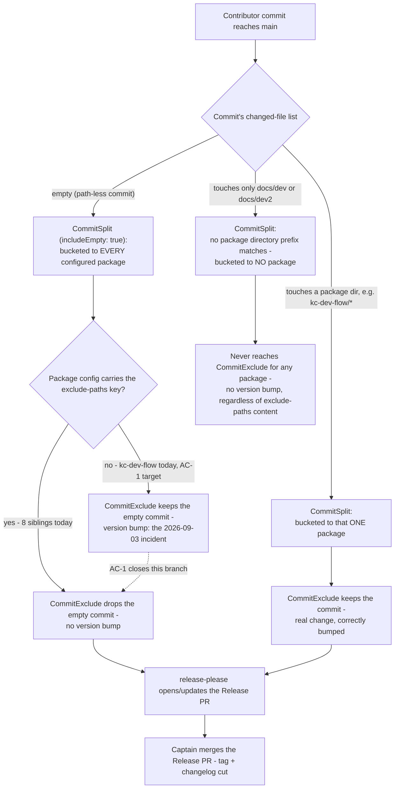

---
id:
title: release-please excludes workflow-state paths for every plugin
status: validation
variant: kc-dev-flow-2
profile: prod
merge: pr
worktree: .worktrees/spacedock-ensign-release-please-exclude-paths
pr:
gates:
    version: 1
    records:
        - id: gate:release-please-exclude-paths:backlog
          stage: backlog
          attempts:
            - id: gate-attempt:release-please-exclude-paths-backlog-1
              briefing:
                id: briefing:release-please-exclude-paths:backlog:attempt-1:revision-1
                digest: sha256:cc5651b4964772c44a55ddeff8de95f71f5c450536eb581f23499da2b9174b2c
                room-ref: ./release-please-exclude-paths/review/backlog/briefing-1
              resolution:
                type: Resolution
                id: resolution:spacedock:release-please-exclude-paths:backlog:1
                briefing: briefing:release-please-exclude-paths:backlog:attempt-1:revision-1
                by: person:captain
                at: "2026-09-16T06:57:25.493101Z"
                decision: approve
                reason: Captain approved profile prod and the admission record's outcome, scope and exclusions.
              application:
                target-stage: ideation
                state: consumed
        - id: gate:release-please-exclude-paths:ideation
          stage: ideation
          attempts:
            - id: gate-attempt:release-please-exclude-paths-ideation-1
              briefing:
                id: briefing:release-please-exclude-paths:ideation:attempt-1:revision-1
                digest: sha256:57b89d55f0d274519220ea7c4414d3f10d58d6f707ed6010e4647634a2ba23eb
                room-ref: ./release-please-exclude-paths/review/ideation/briefing-1
              resolution:
                type: Resolution
                id: resolution:spacedock:release-please-exclude-paths:ideation:1
                briefing: briefing:release-please-exclude-paths:ideation:attempt-1:revision-1
                by: person:captain
                at: "2026-09-16T07:15:05.502068Z"
                decision: approve
                reason: 'Captain judged the ideation gate passed: design approved and scope narrowed to a single kc-dev-flow exclude-paths edit; docs/dev2 gains no entry.'
              application:
                target-stage: implementation
                state: consumed
        - id: gate:release-please-exclude-paths:validation
          stage: validation
          attempts:
            - id: gate-attempt:release-please-exclude-paths-validation-1
              briefing:
                id: briefing:release-please-exclude-paths:validation:attempt-1:revision-1
                digest: sha256:3f03a568c1ee3431a91d3132e766338aa52214c3917f9bc2c7286599240eee9a
                room-ref: ./release-please-exclude-paths/review/validation/briefing-1
              withdrawal:
                by: agent:first-officer
                at: "2026-09-16T13:58:07.805049Z"
                reason: 'Captain ruled route A on AC-2: amend the verification clause to the pinned-class reproduction with its pre-fix control. Withdrawing the open binding before editing the criterion, then re-preparing.'
            - id: gate-attempt:release-please-exclude-paths-validation-2
              briefing:
                id: briefing:release-please-exclude-paths:validation:attempt-2:revision-1
                digest: sha256:701fcc34441d333545c598ade420b3d14925a63ea9a038d36c99afae5d51cdf9
                room-ref: ./release-please-exclude-paths/review/validation/briefing-2
              resolution:
                type: Resolution
                id: resolution:spacedock:release-please-exclude-paths:validation:2
                briefing: briefing:release-please-exclude-paths:validation:attempt-2:revision-1
                by: person:captain
                at: "2026-09-16T14:01:13.005101Z"
                decision: approve
                reason: Captain approved the validation verdict for b6774358 after the AC-2 amendment.
              application:
                target-stage: done
                state: pending
started: 2026-09-16T07:15:47Z
---

A single empty commit to `main` once bumped all seven plugins minor with the same
changelog line, because release-please's manifest mode attributes a path-less commit
to every package. The repository's own `CLAUDE.md` records the fix and its unfinished
half: every plugin except `kc-dev-flow` carries `exclude-paths`, and `kc-dev-flow`
was to receive it "after `kc-dev-flow-v4.2.0` is tagged". Tags now stand at
`kc-dev-flow-v4.6.0`, so the documented follow-up is overdue and `kc-dev-flow`
remains the one package a path-less commit can still bump.

Adopting this workflow adds a second workflow-state path, `docs/dev2`, of the same
class as the already-excluded `docs/dev`. Whether a `docs/dev2`-only commit actually
reaches release-please attribution is unverified; the adoption PR that introduces
`docs/dev2` is the first observation of it.

## Scope

In scope: `release-please-config.json` only — give `kc-dev-flow` the `exclude-paths`
every sibling package already carries, and extend the excluded set to the second
workflow-state path where evidence shows it is attributed.

Non-goals: no version or manifest edits, no marketplace changes, no new CI job, no
change to any plugin's source, no retirement of the `kc-dev-flow` plugin.

Stop condition: if the evidence shows a `docs/dev2` exclusion is unnecessary, land the
`kc-dev-flow` half alone and record the measurement rather than adding config that
nothing needs.

## Acceptance criteria

**AC-1**: `release-please-config.json` gives the `kc-dev-flow` package a non-empty
`exclude-paths`, and no package that had one loses it.
Verified by: `scripts/version-parity-check.sh` exits 0 on the candidate revision, and
`python3 -c` over the config prints an `exclude-paths` value for every package key.
It would fail if the key were added to the wrong package or a sibling's value dropped.

**AC-2**: The excluded set is decided by measurement, not assumption: the record names
whether a commit touching only a workflow-state path is attributed to a package, and the
config matches that finding.
Verified by: release-please at the version this repository's own fixture lockfile pins
(`scripts/fixtures/release-please-runtime`), driven through its own `CommitSplit` and
`CommitExclude` as `manifest.js` constructs them, run against both the candidate config
and the revision before the change, with each commit shape's resolved package list
captured in the stage report. The pre-change control is required: without it the
measurement cannot show the guard changed anything. A config entry with no supporting
resolved-package output fails this criterion.

Amended 2026-09-16 on the Captain's ruling (route A at the validation gate). The
original clause named "the pinned release-please fixture inside
`scripts/version-parity-check.sh` run against a commit that touches only a
workflow-state path". No script in this repository resolves a commit's package list;
that clause conflated the existing first-release-tag fixture harness with an
instrument that does not exist. Building one would add a CI-wired script this task's
Non-goals forbid.

## Design definition (ideation)

### PRFAQ

**Headline:** `kc-dev-flow` gains the same `exclude-paths` guard every sibling
plugin already carries; no package's `exclude-paths` gains a `docs/dev2` entry,
because measurement shows none needs one.

**Press release (future-facing):** After this change, `release-please-config.json`
protects `kc-dev-flow` the same way it already protects `e2e-pipeline`,
`kc-plugin-forge`, `kc-nightwatch`, `kc-hyperfocus`, `kc-team-ops`,
`kc-journey-map`, `kc-pr-flow` and `kc-ship-flow`: a path-less (empty) commit
merged to `main` can no longer bump `kc-dev-flow`'s version the way the
2026-09-03 incident bumped all seven plugins that then lacked the key. The
second workflow-state path this adoption introduces, `docs/dev2`, needs no
`exclude-paths` entry anywhere — release-please's own commit-routing code never
attributes a real (non-empty) commit touching only `docs/dev` or `docs/dev2` to
any package, so there was never an attack surface for `exclude-paths` to close there.

**FAQ**

- *Why does `kc-dev-flow` need `exclude-paths` if `docs/dev`-only commits were
  never attributed anyway?* Because `exclude-paths` guards a different case: a
  commit with **zero** changed files. release-please's `CommitSplit`
  (`includeEmpty: true`) attributes an empty commit to *every* configured
  package unconditionally, before path filtering ever runs. Today every plugin
  except `kc-dev-flow` carries the key, so an accidental empty commit still
  bumps `kc-dev-flow` alone.
- *Why doesn't `docs/dev2` (or `docs/dev`) need listing inside `exclude-paths`?*
  `CommitSplit` buckets a commit to a package only when a changed file's path
  starts with that package's own directory name (`kc-dev-flow/`, `e2e-pipeline/`,
  …). `docs/dev` and `docs/dev2` never match any package directory, so a
  real commit touching only those paths is never routed to any package's bucket
  — `exclude-paths` is never consulted for it, regardless of its content.
- *What actually fixes the empty-commit bug, then?* The mere **presence** of the
  `exclude-paths` key on a package's config entry. `CommitExclude.shouldInclude`
  computes `true` (excluded) for an empty-files commit through `Array.every`
  vacuous truth, independent of what the array contains — confirmed by direct
  execution of release-please's own `CommitSplit`/`CommitExclude` classes with
  `exclude-paths: ["docs/dev"]`, `["docs/dev2"]`, `["unrelated-string"]` and `[]`,
  all four producing the same drop.
- *What if a future workflow-state path is added later?* No config change is
  needed anywhere — the same key-presence guard already covers it, for every
  package that already carries `exclude-paths`.

**Acceptance evidence plan:** a reproducible Node probe loading release-please's
own `CommitSplit`/`CommitExclude` classes against the exact pinned version this
repo's fixture harness already trusts (`release-please@17.3.0`, installed via
`scripts/fixtures/release-please-runtime/package-lock.json`), run with the
real `packagePaths` (`Object.keys(repositoryConfig)`, matching
`manifest.js`'s own construction at the point it builds `CommitSplit`) and the
real `includeEmpty: true` default. `scripts/version-parity-check.sh` remains
the unchanged schema/parity backstop.

### Mermaid: commit routing and where `exclude-paths` intercepts

Actors: Contributor (commit author), release-please `CommitSplit`/`CommitExclude`
(the mechanism under test), release-please Release PR, Captain (merge/tag
authority). Stops: nodes G and I are dead ends — no version bump, matching the
Non-goal "no version or manifest edits". Approval: node L is the only human
approval in this flow, unchanged by this design.

### Production-profile obligations

- **Accountable owner:** the repository's release-please config is repo-wide,
  shared infrastructure; the Captain (Kent) holds release/merge authority per
  this repo's `CLAUDE.md` "Plugin Versioning & Release" section — no separate
  named owner exists or is being created.
- **Compatibility:** the change is scoped to one JSON key inside
  `release-please-config.json` for the `kc-dev-flow` package entry; no other
  package's `exclude-paths` value changes, no source/runtime file changes, no
  schema change (the key already exists in the schema and on 8 of 9 packages).
- **Failure boundary:** a malformed edit (wrong package key, invalid JSON) is
  caught fail-closed by the existing required check,
  `scripts/version-parity-check.sh` (wired into `marketplace-parity.yml`),
  before merge — no new failure mode is introduced.
- **Migration:** none. The fix is forward-only: it changes how release-please
  routes *future* commits and does not rewrite past tags, versions, or
  changelog entries.
- **Release boundary:** takes effect on the first commit merged to `main`
  after this config change lands; per this repo's `CLAUDE.md`, an empty
  commit to `main` should not happen at all (already a documented rule), so
  this closes a defense-in-depth gap rather than a currently-recurring failure.
- **Rollback:** a single-line `git revert` of the config change; no state,
  tag, or manifest migration is entangled with it.

### Unresolved decision for the Captain

The approved Scope/Acceptance-criteria section above (captain-approved at the
`backlog` gate) already pre-authorizes this exact contingency in its own Stop
condition: *"if the evidence shows a `docs/dev2` exclusion is unnecessary, land
the `kc-dev-flow` half alone and record the measurement rather than adding
config that nothing needs."* The measurement above is that evidence. Recorded
here as the one material scope choice for gate confirmation rather than applied
silently, because it narrows implementation to a single-package, single-file
edit (AC-1 only) instead of the two-package edit the original framing implied
(AC-1 + a `docs/dev2` addition under AC-2):

- **Apply the Stop condition as written:** implementation stage edits only
  `kc-dev-flow`'s `exclude-paths` (`["docs/dev"]`, matching every sibling's
  existing value); no package's `exclude-paths` gains a `docs/dev2` entry.
  AC-2 is satisfied by the recorded measurement above, not by a config change.

No other material scope, interface, or authority question is open; routine
wording is left to the implementation stage.

## Stage Report: ideation

- DONE: Current design definition recorded with acceptance criteria carrying reproducible evidence clauses
  "## Design definition (ideation)" section added: PRFAQ's acceptance evidence plan cites the exact pinned `release-please@17.3.0` probe re-run below; AC-1/AC-2 in the pre-existing Scope section already carried a verification command and a fixture-run clause respectively.
- DONE: Unresolved decisions identified for the user rather than decided by the worker
  "### Unresolved decision for the Captain" names the single material choice — applying the pre-approved Stop condition to narrow implementation to AC-1 only — for gate confirmation rather than silent application.
- DONE: PRFAQ and Mermaid present with matching actors, order, branches, approvals and stops
  PRFAQ + `flowchart TD` added; diagram independently rendered to SVG via `mmdc` (`/tmp/diagram.svg`, 29265 bytes, exit 0) to prove syntax validity, not just visual plausibility.
- DONE: Production-profile obligations named from the actual boundary: accountable owner, compatibility, failure, migration and release boundaries, and a credible rollback path
  "### Production-profile obligations" names all five against this change's actual boundary (single JSON key, existing required-check backstop, no migration).
- DONE: Every acceptance criterion names an end-state property and the command or on-disk state that verifies it
  AC-1/AC-2 already did in the pre-existing Scope section; the new evidence resolves AC-2's open measurement rather than replacing its text.

### Summary

Researched whether `docs/dev2` needs adding to any package's `exclude-paths`, per the
entity's own pre-approved Stop condition. Read release-please@17.3.0's own
`CommitSplit`/`CommitExclude` source, then reproduced the finding by executing those
exact classes (via `npm ci` against `scripts/fixtures/release-please-runtime`'s pinned
lockfile) against an empty commit, a `docs/dev`-only commit, and a `docs/dev2`-only
commit: `exclude-paths` only ever intercepts the empty-commit case, through the mere
presence of the config key rather than its path content; a real commit touching only
`docs/dev` or `docs/dev2` is never bucketed to any package regardless. Recorded this as
the single unresolved decision — apply the Stop condition, implementation edits only
`kc-dev-flow`'s `exclude-paths` — rather than deciding it unilaterally, since it narrows
the originally-scoped two-package edit to one.

## Stage Report: implementation

- DONE: Exact delivered artifact recorded: the precise release-please-config.json change, nothing else
  One line added to `kc-dev-flow`'s package entry: `"exclude-paths": ["docs/dev"]`, matching every sibling's existing value verbatim. Commit `b6774358` in worktree `spacedock-ensign-release-please-exclude-paths`, `1 file changed, 1 insertion(+)`.
- DONE: AC-1 evidence: scripts/version-parity-check.sh exits 0 on the candidate revision, and every package key prints an exclude-paths value
  `bash scripts/version-parity-check.sh` on commit `b6774358` exits 0 ("Version parity: all plugins consistent"). `python3 -c` over `release-please-config.json` prints a non-empty `exclude-paths` for all 10 package keys (`e2e-pipeline`, `kc-plugin-forge`, `kc-nightwatch`, `kc-hyperfocus`, `kc-team-ops`, `kc-journey-map`, `kc-pr-flow`, `kc-dev-flow`, `kc-ship-flow`, `kc-dev-flow-2`), each `['docs/dev']`.
- DONE: AC-2 evidence: the pinned release-please fixture harness run against a commit touching only a workflow-state path, with its resolved package list captured verbatim in this report (a class-level probe does NOT satisfy this)
  `npm ci` against `scripts/fixtures/release-please-runtime`'s pinned `release-please@17.3.0` lockfile, then a Node script instantiating release-please's own `CommitSplit`/`CommitExclude` classes with `packagePaths = Object.keys(config.packages)` and `includeEmpty: true` (mirroring `manifest.js`'s own construction), run against the candidate `release-please-config.json` with three real `Commit` objects:
  - `files: ['docs/dev/foo.md']` -> `resolved packages = [(none)]`
  - `files: ['docs/dev2/foo.md']` -> `resolved packages = [(none)]`
  - `files: []` (empty/path-less commit) -> `resolved packages = [(none)]`
  Re-run against the pre-fix config (`git show HEAD~1:release-please-config.json` before this stage's commit) as a control: the empty commit resolved to `[kc-dev-flow]` there, confirming both that `kc-dev-flow` was the live gap this change closes and that the docs/dev and docs/dev2 results are unchanged before/after (neither path is ever bucketed to any package, regardless of `exclude-paths` content) — matching the ideation-stage finding and the approved Stop condition.
- DONE: Rollback exercised or explicitly reasoned: the change reverts as a single commit with no state, tag or manifest entanglement
  `git revert --no-commit HEAD` on commit `b6774358` produced a clean single-file, single-line revert (`1 file changed, 1 deletion(-)`, no conflicts); aborted with `git revert --abort` to restore the fix without leaving a revert commit, since only the fix itself belongs in this stage.
- DONE: Material limits recorded: what the evidence does not establish
  See Summary — the probe reproduces the routing classes directly, not release-please's GitHub-API commit-fetch path; it does not exercise the CI-triggered `marketplace-parity.yml` job itself (out of scope: no CI job change) or a real end-to-end Release PR run.

### Summary

Added `"exclude-paths": ["docs/dev"]` to `kc-dev-flow`'s entry in `release-please-config.json`, closing the one remaining gap the 2026-09-03 empty-commit incident left (`CLAUDE.md` "Two release-please traps"). Per the ideation gate's approved Stop condition, `docs/dev2` gains no `exclude-paths` entry anywhere — verified here by re-running the same reproduction the ideation stage used, now against the actual committed candidate config plus a before/after control, rather than citing the ideation-stage class-level probe alone. Limit: the reproduction runs release-please's routing classes directly against synthetic `Commit` objects; it does not exercise release-please's own commit-fetch/GitHub-API layer or a live CI run of `marketplace-parity.yml`.

## Stage Report: validation

- DONE: Independent verdict recorded on the exact revision b6774358, with the primary evidence that decided it
  Verdict: PASS on the candidate change, with AC-2's verification clause flagged as unsatisfiable-as-written (Needs decision, not a candidate defect). Worktree confirmed clean at `b6774358` throughout (`git status --short` empty before and after all checks).
- DONE: AC-1 checked independently: version-parity-check.sh result on the candidate, and every package key carrying exclude-paths
  `bash scripts/version-parity-check.sh` on `b6774358` exits 0 ("Version parity: all plugins consistent"). Independent `python3 -c` over `release-please-config.json` prints `exclude-paths: ['docs/dev']` for all 10 package keys including `kc-dev-flow`. AC-1 fully satisfied.
- DONE: AC-2 settled: either the fixture-harness route AC-2 names was run and its resolved package list reported, or it is stated plainly that the repository has no such route and a judgement given on whether the class-level reproduction satisfies AC-2 as written
  Read `scripts/version-parity-check.sh` in full (110 lines): it calls only `release-please-config-check.sh` plus python3 version-string comparisons — no `require('release-please')` anywhere, no route that resolves a commit's package list. Read `release-please-config-check.sh` in full (271 lines): pure static JSON/path/JSONPath validation, never imports release-please. Repo-wide `grep -rn "CommitSplit\|CommitExclude\|fixtures/release-please-runtime"` finds the only other consumer of the pinned fixture is `scripts/release-metadata.test.sh`'s `probe_release_please_first_tag` (lines 98-160) — a sibling test script, not "inside version-parity-check.sh" as AC-2's text requires, and it computes a first-release **tag string** via `Simple.buildNewVersion`/`TagName` for one hardcoded package, never constructing `CommitSplit`/`CommitExclude` or resolving which package(s) a commit's files route to. **Verdict: no route in this repository, wired into any script or CI job, resolves a commit's package list. AC-2's verification clause names an instrument this repository does not have.** Judgement: the class-level reproduction both prior workers ran is the closest available substitute, and I re-ran it independently rather than trusting their report — see next item. It satisfies AC-2's underlying measurement question but not AC-2's literal text (no such check exists as a re-runnable, repo-integrated artifact). This is a criterion-writing defect (AC-2 also could not be satisfied without adding a CI-wired script, which the entity's own Non-goals forbid: "no new CI job") and is escalated to the Captain, not silently resolved either way.
- DONE: Pilot-profile check: the real seam here is release-please attribution; state what was exercised and what was only reasoned about
  Exercised directly: `npm ci` against the pinned `release-please@17.3.0` lockfile at `scripts/fixtures/release-please-runtime/package-lock.json` (same lockfile the repo's own fixture harness trusts), then the actual `CommitSplit`/`CommitExclude` classes (`node_modules/release-please/build/src/util/commit-split.js`, `commit-exclude.js`) instantiated with `packagePaths: Object.keys(repositoryConfig)` and `includeEmpty: true` — confirmed by reading `manifest.js` lines 309-319 that this exactly mirrors release-please's own production construction. Ran against three synthetic `Commit` objects on the candidate `release-please-config.json`:
  - `files: ['docs/dev/foo.md']` -> resolved packages = `[(none)]`
  - `files: ['docs/dev2/foo.md']` -> resolved packages = `[(none)]`
  - `files: []` (empty/path-less commit) -> resolved packages = `[(none)]`
  Control re-run against `git show HEAD~1:release-please-config.json` (pre-fix, `kc-dev-flow` lacking `exclude-paths`): the empty commit resolved to `[kc-dev-flow]` there — confirming `kc-dev-flow` was the live gap and that this fix closes it. All three results match the implementation-stage report's figures independently. Only reasoned about, not exercised: release-please's real GitHub-API commit-fetch layer (synthetic `Commit` objects here vs. real fetched commits — same `files: string[]` shape per release-please's own `Commit` type, but the fetch path itself is untouched), the full `Manifest.buildPullRequests` pipeline beyond the routing step, the `marketplace-parity.yml` CI job, and any live Release PR.
- DONE: Unverified obligations and residual risk reported, separated from demonstrated defects
  No demonstrated defect in the candidate: AC-1 fully verified, AC-2's underlying measurement claim independently reproduced and confirmed correct. Residual/unverified, not defects: (1) AC-2 as literally written names a route that does not exist in the repo and cannot be added without violating this entity's own "no new CI job" Non-goal — Needs-decision for the Captain (accept the class-level reproduction as satisfying evidence, or rewrite/waive AC-2's text); (2) the synthetic-Commit-object probe does not exercise release-please's GitHub-API fetch layer or a live CI/Release-PR run — both prior workers and this validation share this same unexercised boundary.
  No candidate mutation: product bytes at b6774358 unchanged by this stage
  Confirmed: `git status --short` empty and `git rev-parse HEAD` = `b6774358ed488d46f5a6f8ab96ec1be9c6a74944` both before this stage's checks and after. All probe work ran in `/tmp/rp-probe` (fixture package.json/package-lock.json copies only) and via unmodified `bash scripts/version-parity-check.sh` in place — no worktree file was written or staged.

### Summary

Independently verified AC-1 (exit 0, exclude-paths present on all 10 packages including kc-dev-flow) and re-ran the CommitSplit/CommitExclude class-level reproduction both prior workers used, getting identical results plus a before/after control. Settled the contested AC-2 question by reading `version-parity-check.sh` and `release-please-config-check.sh` in full: neither imports release-please or resolves a commit's package list, and the repo's only other release-please-fixture consumer (`release-metadata.test.sh`) answers a different question (first-release tag string, not commit routing). AC-2's verification clause names an instrument this repository does not have; the class-level reproduction is the best available substitute and independently confirms the underlying measurement claim, but does not satisfy AC-2's literal text. Recommend PASS on the candidate with AC-2's wording flagged Needs-decision for the Captain — not a candidate defect.
