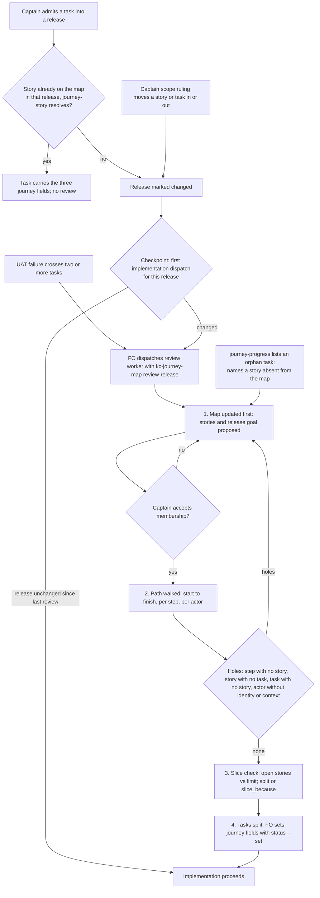

A release gains tasks one at a time and nothing checks that together they still form one complete journey; batch C part 2 of the dev2 fixes.

## Scope

Captain 2026-09-30: 「有部分關係，你稍後可以找那個 peer ，有一個新的提議是 cl 認為每個切片只能有五件事，你可以跟他交換這個問題的細節，並且看看是否可以把這個規則跟 520 結合，那個 peer 就可以專心處理 relay + spacedock review 的旅程問題。我們來解決 520 問題。」 This task covers issue #520 and the proposed "a slice holds at most five things" rule.
Evidence (qnow, 2026-09-29, issue #520): over two days the Captain ruled eight-plus tasks into one release, each filed and designed on its own scope; the journey map's release stayed at its five stories of 2026-09-23 and the shop journey had none; cross-task holes surfaced only at Captain UAT (no brand context in the owner app, no signed-in identity in the office, no task that takes a real shop live on production). On 2026-09-30 the Captain then re-cut qnow's go-live slices from a whole-journey analysis before any dev2 fix.
Five-things rule, handed over 2026-09-30 by the peer session that drafted it (Captain not yet ruled on its design): proposed in a design review of another adopter's journey, where a reviewer could not discuss a release slice whose one column mixed two actors' actions and asked for at most five things per slice so people can hold the whole slice in their head. Captain: 「我覺得每片五件事最多可以開一個 PR 回去上游，讓切 slice時有依據，等於預設就是五件事。」 and 「我想像是可能會有 r2.1, r.2.2 等切片，每一片約莫是一天到兩天的實作量」. Draft: one thing is a story in the release whose status is not `exists` (steps, acceptance criteria and tasks are not counted); default limit 5, overridable per journey by a top-level `slice_limit`; advisory, not a gate: journey-lint prints a line like the existing `long-card (advisory)`, and `references/release-slicing.md` says a slice over the limit splits into sub-slices or states why not; the handoff budget check (`lib/journey-handoff.mjs`, estimate vs appetite) does not refuse on count, because `release-slicing.md` already says story count does not establish fit and this rule is about cognitive load, not fit. Case: after a redraw that adopter's first slice still held 14 stories, 10 not yet existing, and an independent read-only review flagged it as not a clear five-step demo; the other slices held 4, 4, 2 and 2. A second peer session confirmed the case and adds: in the review the unit of "thing" was never defined ("five things, or pick a number", reason: cognitive overhead), counting one story card per thing was that session's reading, and whether stories that already exist count is open; the Captain's own sizing words are the one-to-two-days line above, and on the oversized slice: 「這幾個活動其實包含了第二角色但沒呈現」. Public-repo rule: the package and its PR state only the generic reason.
Non-goals: no new stage, gate or Spacedock change; no blocking limit on slice size; no counting of steps, tasks or acceptance criteria; no automatic writing of task fields (FO writes them with `status --set`); no version field on releases; no reader change for a task that delivers several stories (deferred, measured in the design); no default day-appetite number.

## Design

### PRFAQ

**Press release.** A release is no longer patched one task at a time. When the Captain admits a task into a release, rules a scope change, or a UAT failure crosses tasks, the release is walked end to end as one journey: the journey map is updated first, the path is walked from the person's first situation to the observable finish, and only then are tasks split. A slice also stays small enough to read at once: when a slice holds more than five stories that do not exist yet, the journey linter prints one advisory line, and the slice is split or says why it is not.

**FAQ.**

- *Does every task trigger a review?* No. A task that delivers a story already on the map, in a release whose story set has not changed, passes with one check: its `journey-story` resolves. The review runs once per batch at a single checkpoint, and only when a signal has marked the release changed since its last review.
- *Who runs it?* A fresh worker that FO dispatches with the `kc-journey-map` skill in a new `review-release` mode; the Captain decides membership. FO writes no map and no candidate. Model: the workflow default; opus only when the Captain's scope ruling is contested.
- *Is five a gate?* No. It is an advisory line, like the existing `long-card (advisory)`. `journey-handoff.mjs` does not refuse on count.
- *Does five mean one to two days?* No. Story count is a cognitive-load cue. Fit stays with the handoff's appetite-versus-estimate check, as `release-slicing.md` already says.

### Chain check (what exists, where; origin/main 2bd1bfab)

| Layer | Exists | Reused / changed |
| --- | --- | --- |
| kc-journey-map | `skills/kc-journey-map/references/release-slicing.md` (removal test, "story count does not establish fit", appetite vs estimate); `lib/journey-handoff.mjs` (checks one cut release at cut time only); `references/interrogation.md` (questions before development, not a whole-path walk); `lib/journey-lint.mjs` + `lib/lint.mjs` (`longCards`, the advisory pattern); `lib/progress.mjs` + `kc-journey-progress` (reads `journey`, `journey-release`, `journey-story`, `journey-required-tasks`, `journey-mapping-complete` from tasks) | Reuse all. New: `oversizedSlices`, `slice_limit`, `slice_because`, an `orphans` list in `journey-progress`, a `review-release` mode and reference |
| kc-dev-flow-2 | `references/sd/workflow.md` `backlog` stage and its `## FO alignment` record; no journey fields in the task template or stage text; `references/sd/workflow.md` says a deferred capability belongs on the journey map | New prose only: signals, single checkpoint, task fields, `Release review:` line |
| kc-dev-flow (v1) | `choose-work-profile`, `adopt-dev-flow`: scalar `release: <journey>/<release-id>` plus `release-readiness`, "refused unqualified" (`profile-contract-loader.py`) | Not reused: a different field pair from the one `kc-journey-progress` already reads; a release id is qualified by its journey there |
| spacedock 0.27.2 | `status --set <slug> key=value` accepts `journey`, `journey-release`, `journey-story`; `status --all-fields --json` returns them (probed 2026-09-30 in a scratch workflow under /tmp) | No change needed |
| Adopters | qnow `docs/journey/qnow-owner.yaml`, `qnow-shop.yaml` at `ddc58ea90` (`origin/next`); no file under its `docs/dev2/.spacedock-state`, active or archived, contains `journey-release` (`grep -rl`, 0 files, 2026-09-30) | Evidence below |

### The five-per-slice unit, measured on qnow (`ddc58ea90`, both journey files)

| Candidate unit | What it counts | Over five, per journey file | Over five, by release id across both files |
| --- | --- | --- | --- |
| Open stories (status is not `exists`) | work still to plan and hold in mind | owner `r3` (6) | `r3` 8, `r13` 9, `r11` 8, `r9` 6, `r17` 6 |
| All stories | done and open alike | owner `r1` (6), owner `r3` (6), shop `r1` (18 of which 17 exist) | adds `r1` (24) |
| Steps touched | activity columns a release reaches | none (largest 5) | none |
| Tasks | tasks per release | not computable: no task carries the release, and tasks exist only after the split | same |

- **Recommendation: count open stories, per journey file.** All-stories flags two releases that already shipped; steps never flag; tasks come after the slice. Open stories flags the one release a reader would want to split. What gets worse: a release that mixes many finished stories with five new ones passes although a reader still sees the finished cards.
- **Per file, not per release id across files.** The package qualifies a release by its journey (`profile-contract-loader.py`: a bare id is unique only while one journey file exists); qnow's shared ids are its own convention. What gets worse: per-file lint catches one of qnow's five across-file oversized ids (`r3`). The review reference tells the reviewer to add the counts by hand when releases in several journey files are one demo.
- **Against sizing.** qnow's own release notes tag `r3` "about S" with 8 open stories across both files and `r4` "about M" with 5 (its notes call the estimates unmeasured). Count and size do not line up, so the rule stays a load cue and is not a fit test. The Captain's "one to two days" is an appetite the handoff already records (`budget.appetite`, `user_basis`); no day number is encoded.
- **Override.** Top-level `slice_limit` (positive integer; anything else is a `invalid-slice-limit` violation, because a typo would silently read as the default, as `lintQuestionStatus` guards for statuses). Per-release `slice_because` (non-empty text) turns the advisory into `slice-size (accepted): ... because ...`.
- **Where checked.** Advisory line in `journey-lint.mjs`: `slice-size (advisory): release r3 holds 6 stories that do not exist yet (limit 5); split into sub-slices or record slice_because`. Exit code unchanged. Spike (throwaway copy of origin/main lib under /tmp): owner file printed a line of that form for `r3` and only for `r3`; the shop file and `journey.example.yaml` printed nothing; all three ended `all lints pass`.

### Release review

- **Signals.** (1) A task admitted into a release; (2) a Captain scope ruling that moves a story or task into or out of a release or changes its goal; (3) a UAT failure that crosses tasks; (4) before a batch enters implementation. Signals 1 and 2 only mark the release changed; signal 4 is the single checkpoint where a marked release is reviewed; signal 3 runs the review at once, because a cross-task hole is the design defect the review exists for.
- **Anti-ceremony.** Signal 1 costs one check when the story is already mapped in that release. A task with no release (bug, infrastructure, workflow maintenance) is outside all four signals. One review covers every change since the last, however many tasks were admitted. Nothing here adds a stage or a gate; the Captain accepts membership in the conversation or at the task's existing backlog gate.
- **Who and what.** The review worker follows a new `references/release-review.md` in kc-journey-map, in the order the issue asks: map first, path walk, then split. Output: the proposed journey edit (a PR against the map, as adopters already do); a walk table (step, actor, observable outcome, identity, context, shown, story, task or `none`, status) with the holes named; the slice count with split or reason; the task list with proposed journey fields. It reuses the removal test and constraint checks of `release-slicing.md` and the handoff assessment's `outcome.start` / `finish` / `verification`. Interrogation stays a separate mode.
- **Recording.** FO writes `Release review: <journey>/<release-id> at <journey-file commit>` or `Release review: not needed: <reason>` under the task's `## FO alignment`. It is a procedure line; no script checks it (advisory, named plainly).
- **Map first, enforced where it can be.** `journey-progress.mjs` gains `orphans`: tasks whose `journey` equals the map's journey but whose release and story are not on the map. Non-empty orphans exit 1. This would have caught #520's tasks admitted into a release the map did not hold, provided they carried the fields.

### Task fields (question 2)

- Yes: a task admitted into a release story carries scalar `journey`, `journey-release`, `journey-story`, the fields `kc-journey-progress` already reads. FO sets them with `spacedock status --set` when it approves the task at the backlog gate; the ensign never edits frontmatter. The dev2 task template shows them as optional.
- The completion declaration (`journey-required-tasks`, full stored ids; `journey-mapping-complete: true`) is written by FO on one task per story at the review's split step, only for an adopter that has opted into `journey-progress` completion. The review is the natural moment because the exhaustive list is known then. An admission that changes the list without updating the declaration reads `unverified` in the next refresh: that is the existing drift signal.
- **Known limit, deferred.** One scalar `journey-story` per task. qnow's tasks deliver several stories each (its `r3` note names two tasks for 8 open stories), so completion by story cannot be computed for them without a reader change (a story list plus per-story declarations). No qnow task carries the fields today, so there is no observed consumer; that reader change is a follow-up for the Captain to schedule, not part of this task.

### Ownership and PRs (question 4)

| Piece | Plugin | PR |
| --- | --- | --- |
| `oversizedSlices`, `slice_limit`, `slice_because`, `invalid-slice-limit`; `orphans`; `review-release` mode row and `references/release-review.md`; the sentence in `release-slicing.md` (count is load, not fit; over five splits or states why); tests; the ADR | kc-journey-map | PR 1, `feat(kc-journey-map): ...` |
| Signals, single checkpoint, `Release review:` line and journey fields in `workflow.md` backlog stage and task template; README pointer | kc-dev-flow-2 | PR 2, `feat(kc-dev-flow-2): ...`, after PR 1 merges (it names PR 1's mode) |

Two PRs, because repo CLAUDE.md scopes a feature PR to one plugin's files and release-please attributes one commit to every plugin it touches. The plugins meet only through the task field names, which `kc-journey-progress` owns; kc-dev-flow-2 pins them by string and imports no code. No kc-dev-flow change (v1 stays on its own `release` pair). No spacedock change.

### ADR

One ADR is needed, named by its ruling and short title: "a slice holds at most five stories that do not exist yet, by default, as an advisory" (`a-slice-holds-five-open-stories-by-default`). It records the Captain's ruling, the unit, the rejected units and why the rule is not a gate. FO reserves its number when it dispatches implementation (`number_guards.py reserve --kind adr`); a dry run at origin/main 2bd1bfab on 2026-09-30 printed one `ADR:` line and left the task and state checkout untouched, so the path works. The number is bound at dispatch and is not written here. PR 1 carries the ADR; the record states only the generic reason for the rule.

### Bounded existing-code check

Reused: the task-field reader, the `long-card (advisory)` pattern, `release-slicing.md`, `interrogation.md`, `journey-handoff.mjs`, `status --set`. Not reused: kc-dev-flow v1's `release` pair (other field names). New code is `oversizedSlices` (about ten lines in the spike) and `orphans`; everything else is prose. Observation that the change is needed: #520 (tasks admitted into a release the map never held; holes found only at UAT) and the qnow numbers above.

### Needs the Captain

One ruling: the unit of a "thing". Recommendation: a story whose status is not `exists`, counted per journey file. Stories that already exist do not count. The two alternatives and their qnow counts are in the table above.

### Captain-run acceptance script (after PR 1 merges and kc-journey-map is synced locally; qnow `next` at or after `ddc58ea90`)

1. From the installed kc-journey-map: `node lib/journey-lint.mjs docs/journey/qnow-owner.yaml <qnow-repo-root>`. It prints `slice-size (advisory): release r3 holds 6 stories that do not exist yet (limit 5); split into sub-slices or record slice_because`, then `all lints pass`, and exits 0.
2. Add a top-level `slice_limit: 6` to that file: the `slice-size` line disappears. Restore it, then add `slice_because: <text>` to the `r3` entry under `releases:`: the line becomes `slice-size (accepted): release r3 holds 6 stories that do not exist yet (limit 5) because <text>`. Restore the file. A `slice_limit` of `0`, `"5"` or `2.5` prints `invalid-slice-limit: ...` and exits 1.
3. `spacedock status --workflow-dir docs/dev2 --set <task> journey=<the map's own journey: value> journey-release=r3 journey-story=<story-id-not-on-the-map>` on a task with a valid stored id, then `node lib/journey-progress.mjs docs/journey/qnow-owner.yaml --workflow-dir docs/dev2`. It prints JSON whose `orphans` is `[{"slug": "<task>", "id": "<short id>", "release": "r3", "story": "<that story id>"}]` and exits 1. The exit is also 1 with no orphan while no task is verified (every qnow story is unverified today), so the `orphans` list is the discriminator: a task naming a story on the map gives `"orphans": []`. Clear the three fields afterwards.

## Acceptance criteria

**AC-1**: `journey-lint.mjs` prints `slice-size (advisory): release <id> holds <n> stories that do not exist yet (limit <k>); split into sub-slices or record slice_because` for a release with more than `k` stories whose status is not `exists`, counted within one journey file, default `k` 5, and its exit code is unchanged by the line.
Verified by: node tests in `lib/lint.test.mjs` (CI runs `node --test lib/*.test.mjs`): 6 open stories print the line; 5 open print none; 1 `exists` plus 5 open print none; a CLI run exits 0 with the line present. Falsifier: changing `>` to `>=` fails the 5-open case. Current evidence: spike on qnow `ddc58ea90` printed the line for owner `r3` (6) only, none for shop or `journey.example.yaml`. Limit: a per-file count misses across-file totals.

**AC-2**: A top-level `slice_limit` (positive integer) replaces the default; any other value is an `invalid-slice-limit` violation; a per-release non-empty `slice_because` turns the advisory into `slice-size (accepted): ... because ...`.
Verified by: node tests: `slice_limit: 6` silences owner `r3`; `0`, `"5"` and `2.5` each yield the violation and exit 1; a release with `slice_because` prints the accepted form and an empty `slice_because` still prints the advisory. Not yet verified: no test exists yet.

**AC-3**: The count never refuses a handoff: `journey-handoff.mjs` passes a release of more than five open stories whose assessment is otherwise valid, and `release-slicing.md` says a slice over the limit splits into sub-slices or states why, that the count is a cognitive-load cue, and that fit stays appetite versus estimate.
Verified by: a new case in `lib/journey-handoff.test.mjs` (7 open stories, valid assessment, exit 0); falsifier: adding a count refusal to the handoff fails it. Prose is read against `release-slicing.md`'s existing "story count does not establish fit" sentence. Not yet verified.

**AC-4**: `journey-progress.mjs` lists `orphans`, tasks whose `journey` equals the map's but whose release and story are not both on the map, and exits 1 when any exist.
Verified by: a pure-function test on `calculateProgress`'s neighbour with fake task rows (orphan, mapped, other-journey row ignored), plus an integration test in `lib/progress.test.mjs` that runs the real pinned `spacedock` against a scratch workflow whose task has `journey-story` absent from the map. Falsifier: reading only mapped tasks yields an empty list and fails both. Current evidence: `status --set` and `--all-fields --json` round-trip the three fields on spacedock 0.27.2 (scratch probe). Not yet verified for orphans.

**AC-5**: kc-journey-map has a `review-release` mode (SKILL.md row) and `references/release-review.md` that order the work map first, path walk, slice check, then task split, define the walk table and the four hole classes, and tell the reviewer to add counts by hand across journey files that share a demo.
Verified by: `skill-frontmatter-lint.sh` and `node --test lib/*.test.mjs` stay green; a replay: a fresh worker given only the reference and qnow's maps and task list at `cebce1173` (the 2026-09-29 regrade, before the re-cut) produces a walk that names the three holes the issue recorded (no brand context in the owner app, no signed-in identity in the office, no task that takes a real shop live). Pass or fail is the Captain's issue text. Agent-run and non-deterministic; not yet run.

**AC-6**: kc-dev-flow-2's `workflow.md` states the four signals, that signals 1 and 2 only mark a release changed, the single implementation checkpoint, the skip cases (no release; story already mapped in an unchanged release), the `Release review:` line, and that FO sets the three journey fields with `status --set` at the backlog gate; the task template shows them as optional.
Verified by: `lint-skills.py` and the existing `test_*.py` in `.github/workflows/kc-dev-flow-2-tests.yml` stay green; a scratch-workflow rehearsal in which a task naming an unmapped story is held and a task naming a mapped story is admitted with the fields set. The prose is not machine-checked, and nothing enforces the `Release review:` line. Not yet verified.

**AC-7**: The change ships as two Conventional-Commit PRs, kc-journey-map first, each touching only its own plugin (plus the ADR in PR 1), with no version edits and no mention of another adopter, its people, meetings or product.
Verified by: PR file lists; `kc-plugin-forge-sanitize-check` on each plugin; required checks `marketplace-parity.yml` and skill frontmatter lint pass; the PR titles read `feat(kc-journey-map): ...` and `feat(kc-dev-flow-2): ...`.

**AC-8**: One ADR records the slice rule and lints clean.
Verified by: `python3 <package>/scripts/adr_lint.py docs/adr --require <reserved number>` at validation, the number reserved by FO at implementation dispatch. Not yet verified.

## FO alignment

Needed at ideation: at which signals a release is re-reviewed as a whole journey (a task admitted into a release, a Captain scope ruling, a UAT failure that crosses tasks, before a batch enters implementation) and what the re-review produces; whether tasks carry `journey`, `journey-release` and `journey-story` so kc-journey-progress can compute completion; what "a slice holds at most five things" counts, where it is checked and what happens above five; which parts belong to kc-dev-flow-2 and which to kc-journey-map.
Result: the FO delegates these questions to ideation, which decides each with its source and returns any ruling that needs the Captain.
Surfaces: none
Visible change: none

## Number guards

ADR: 0006

## Stage Report: ideation

- DONE: Design the change for issue #520 with the five-per-slice rule: signals, task fields, unit and check, ownership (questions 1 to 4)
  `## Design` in this file: four signals with a single checkpoint and skip cases, scalar task fields with a deferred multi-story limit, open-story unit per journey file with qnow counts, two PRs with kc-journey-map first; Mermaid matches the prose.
- DONE: Check the chain first and report what exists and where
  `### Chain check` table (origin/main 2bd1bfab): kc-journey-map, kc-dev-flow-2, kc-dev-flow v1, spacedock 0.27.2 field round-trip probe, qnow files at ddc58ea90; no task in qnow's state carries `journey-release`.
- DONE: ACs with evidence plans, ADR need, what needs the Captain, Captain-run acceptance script
  `## Acceptance criteria` AC-1..AC-8; ADR named by short title with `reserve --kind adr` dry run (printed one line, state untouched); one Captain ruling (the unit); three-step script.
- DONE: AC-1 slice-size advisory line, exit unchanged
  Spike on qnow ddc58ea90 printed it for owner r3 (6 open) only, none for shop or journey.example.yaml; node tests not yet written.
- DONE: AC-2 `slice_limit`, `invalid-slice-limit`, `slice_because`
  Not yet verified; test plan names 6, 0, "5", 2.5 and the empty reason.
- DONE: AC-3 count never refuses a handoff; release-slicing.md sentence
  Not yet verified; plan is a 7-open-story handoff case that must exit 0.
- DONE: AC-4 `orphans` in journey-progress
  `status --set` and `--all-fields --json` round-trip the three fields on spacedock 0.27.2 (scratch probe); orphan logic not yet verified.
- DONE: AC-5 `review-release` mode and reference
  Not yet verified; replay at qnow cebce1173 must name the three holes the issue recorded (agent-run, non-deterministic).
- DONE: AC-6 dev2 signals, checkpoint, `Release review:` line, journey fields
  Not yet verified; prose is not machine-checked and nothing enforces the line.
- DONE: AC-7 two PRs, kc-journey-map first, scoped, sanitized
  Not yet verified; checked by PR file lists, sanitize-check and required checks.
- DONE: AC-8 one ADR lints clean
  Not yet verified; `adr_lint.py --require <reserved number>` at validation.
- DONE: `design_surfaces.py check` passes
  Installed 0.9.0 copy and origin/main copy both printed `release-review.md: design surfaces presentable`, exit 0.

### Summary

The release is re-reviewed at four signals but run once, at one implementation checkpoint, and skipped when a task delivers an already-mapped story; kc-journey-map owns the walk and the advisory `slice-size` line, kc-dev-flow-2 owns when FO asks, in two PRs. The one Captain ruling is the unit: open stories per journey file, against all stories, steps, tasks or a count across files (qnow: 1, 3, 0 and 5 releases flagged). Deferred and flagged: a task delivering several stories cannot carry a story list, no qnow task carries the fields yet, and `Release review:` is a procedure line no script checks.

## Stage Report: implementation

- DONE: Implement release-review's approved design as two commit groups so the FO can open two PRs, no commit touching both plugins
  Group 1 ends ffeb5c0a60d193013008834f138d2a0a9c6d8343 (only `kc-journey-map/**` and `docs/adr/`); group 2 ends b7a45bed49f3f4fa9f92808bd297948638bda26f (only `kc-dev-flow-2/**`); `git diff --name-only` per group filtered for other paths prints nothing; no version edit.
- DONE: Every AC with the evidence its "Verified by" names that implementation can produce, including each falsifier; AC-5's replay left to validation
  Per-AC lines below; at g1 `node --test lib/*.test.mjs` 168 pass; at g2 `lint-skills.py`, seven `test_*.py`, `test_sd_dispatch.py` (spacedock 0.27.2 CLI, cache 0.27.0 plugin root) and `skill-frontmatter-lint.sh` exit 0. Tests ran with the plugin's declared deps present (node_modules symlink, removed); a fresh worktree needs `npm ci` in `kc-journey-map/`.
- DONE: The task file has two identical `## Acceptance criteria` sections; keep the first, remove the duplicate, change no criterion text beyond the Captain's unit ruling
  `grep -c '^## Acceptance criteria'` prints 1 (line 162), so nothing was removed; no criterion text changed, AC-1 and AC-2 already carry the unit (not `exists`, per journey file), recorded also in the gate reason and ADR 0006.
- DONE: ADR 0006 in docs/adr with the Captain's words, generic reason only
  `docs/adr/0006-a-slice-holds-five-open-stories-by-default.md`, words 「還沒做好的故事，每張旅程圖分開算」, ideation gate 2026-09-30; `adr_lint.py docs/adr --require 6` exit 0 at g1 (installed 0.9.0 copy and the candidate's copy); no adopter name in the diff or commit messages (grep 0).
- DONE: Repository conventions, comment ratio, doc_impact, the SHA ending each group, the acceptance script rewritten against the shipped text
  Commits `feat(kc-journey-map): ...` and `feat(kc-dev-flow-2): ...`, files staged by name; candidate `comment_ratio.py 2bd1bfab HEAD` exit 0 (154 code lines, 3 comment lines, 1.9%); installed `doc_impact.py 2bd1bfab HEAD` printed 0 documents mention what changed; `### Captain-run acceptance script` rewritten to the shipped line and JSON shapes.
- DONE: AC-1 slice-size advisory line, exit unchanged
  `lib/lint.test.mjs`: 6 open print the line, 5 open or 1 exists + 5 open print none, CLI exits 0 with the line and `all lints pass`; mutations `>` to `>=` fails 4 tests, dropping the `exists` filter fails 1, `process.exit(violations.length || oversizedSlices(model).length ...)` fails 1; limit: per-file count.
- DONE: AC-2 `slice_limit`, `invalid-slice-limit`, `slice_because`
  Same file: `slice_limit: 6` silences 6 open, `0`/`"5"`/`2.5`/`-1`/`null`/`true` each give one violation and the CLI exits 1; `slice_because` prints `(accepted) ... because ...`, empty or blank keeps the advisory; mutations `?? default` (no validity check) and bare `because` (no non-empty check) each fail 1.
- DONE: AC-3 count never refuses a handoff; release-slicing.md sentence
  `lib/journey-handoff.test.mjs`: 7-open-story handoff exits 0; a mutation adding `selected.length <= 5` to the oversized check fails 1; a new case (`slice_because`/`slice_limit` added after the pre-cut copy) failed before I allowed them in `withoutCuts` and the selected release, passes now; prose in `release-slicing.md`.
- DONE: AC-4 `orphans` in journey-progress
  `lib/progress.test.mjs`: pure `findOrphans` case (mapped, wrong story, wrong release, wrong pair, half-set, other-journey ignored) and a real-`spacedock` case (orphan listed; refresh CLI exit 0 clean, exit 1 with the orphan); mutations `filter(() => false)` fails 2, removing `orphans.length` from the exit condition fails 1.
- DONE: AC-5 `review-release` mode and reference; lints stay green; the replay is validation's
  `SKILL.md` mode row and `references/release-review.md` (order, walk table, four hole classes, hand-added counts); `skill-frontmatter-lint.sh` and node tests green; the qnow replay was not run.
- DONE: AC-6 dev2 signals, checkpoint, `Release review:` line, journey fields
  `references/sd/workflow.md` backlog bullet and template note, README pointer; `lint-skills.py` and the `test_*.py` green; scratch rehearsal in /tmp with the real template: `status --set` wrote the three fields, `journey-progress.mjs` listed only the unmapped-story task as an orphan and exited 1. The FO holding the task is prose, not run; nothing checks the `Release review:` line.
- DONE: AC-7 two Conventional-Commit groups, scoped, no version edits
  Titles `feat(kc-journey-map): ...` and `feat(kc-dev-flow-2): ...`; per-group file lists above; sanitize-check and CI checks are for the PRs.
- DONE: AC-8 one ADR lints clean
  `adr_lint.py docs/adr --require 6` prints `6 ADR file(s) checked, 0 legacy`, exit 0, at g1.

### Summary

Two commit groups on `spacedock-ensign/release-review`: kc-journey-map (advisory `slice-size` line, `slice_limit`, `slice_because`, `orphans` with exit 1, `review-release` mode, ADR 0006) then kc-dev-flow-2 (signals, single checkpoint, `Release review:` line, optional journey fields). One fix beyond the design: `journey-handoff.mjs` refused a candidate that recorded `slice_because` or `slice_limit` after the pre-cut copy, so it now allows both. The existing progress CLI test's decoy task became an orphan, so it now uses another journey. Limits: the AC-5 replay and the FO's hold behaviour are unrun; the qnow files were not re-linted here.

## Stage Report: validation

- DONE: Independent verdict on candidate b7a45bed49f3f4fa9f92808bd297948638bda26f (branch spacedock-ensign/release-review, base 2bd1bfab; group 1 kc-journey-map + ADR ends ffeb5c0a60d1, group 2 kc-dev-flow-2 ends b7a45bed) against release-review's approved design, AC-1..AC-8 and the Captain's unit ruling.
  AC-1 to AC-4, AC-7, AC-8 met and the unit ruling is implemented (open stories, per journey file); AC-6 prose present, machine-checked only by lint; AC-5 replay not met (see the replay item); verdict below.
- DONE: Reproduce on `git archive` copies at both group SHAs (node tests, kc-dev-flow-2 CI suite, skill lint, version parity), each named mutation one at a time, group scoping, group 1 alone.
  `npm ci` + `node --test lib/*.test.mjs` 168 pass 0 fail at both SHAs; `lint-skills.py`, 7 `test_*.py` and `skill-frontmatter-lint.sh` exit 0 at both; `test_sd_dispatch.py` exit 0 but ran with plugin root cache 0.27.0 (CI pins 0.27.2 by tag); `version-parity-check.sh` exited 1 on the archive copies only because it enumerates git-tracked files (harness, not candidate), then exited 0 ("all plugins consistent") on `git clone` checkouts at ffeb5c0a60d1 and b7a45bed49f3; `git diff --name-only` shows group 1 only `kc-journey-map/**` + `docs/adr/`, group 2 only `kc-dev-flow-2/**`; group 1 passes its own tests without group 2.
  Mutations, each alone on a copy under /tmp/rr, all caught: `>` to `>=` (4 fail), drop the `exists` filter (1), exit code counts the advisory (1), no `slice_limit` validity check (1), bare `slice_because` (1), drop `lintSliceLimit` (2), handoff refuses count (1), drop `delete result.slice_limit` (1), drop `slice_because` allowance (1), orphans always empty (2), orphans out of the exit condition (1), orphan check ignores journey (3).
- DONE: Lint qnow's journey files read-only with the candidate journey-lint at origin/next (ddc58ea90); judge the `journey-handoff.mjs` fix beyond the design as a finding.
  Owner file prints one `slice-size (advisory)` line, for r3 (6 open), exit 0 and `all lints pass`; shop file prints none, exit 0; `journey.example.yaml` prints none; local origin/next was not re-fetched. The handoff fix (`slice_limit` deleted from both sides, `slice_because` allowed on the selected release) is owned and required: without it recording either field after the pre-cut copy refuses the handoff, so AC-2 and AC-3 would not compose; mutations 8 and 9 above each fail its test.
- FAILED: Run AC-5's replay (fresh Sonnet, isolated plugin state, review-release mode, qnow maps and task list at cebce1173) and pass only if the walk names the three holes issue #520 records.
  Two runs (`--plugin-dir` /tmp/rr/g1/kc-journey-map, `DISABLE_PLUGIN_AUTOLOAD=1 --setting-sources local`; init lists only that plugin path, both runs called Skill `kc-journey-map:kc-journey-map` then Read the snapshot's `release-review.md`): run 1 and run 2 both missed "no brand context in the owner app" (no walk row or hole mentions it) and both named "no task that takes a real shop live" only via `| onboard-shop | Platform operator | Entry opened after closures are set (ADR 0005) | none | none | **hole: step with no story** |` (run 2: `| onboard-shop | ... | Shop goes live on the production Clerk instance | none | production-on-qnow-tw-clerk-live (backlog) | **H1 and H3** |`); "office cannot show who is signed in" is only adjacent: `| staff-sign-in | Manager, real shop | Signs in with a real phone number | ... | production-on-qnow-tw-clerk-live (backlog, no story) | ... **holes: actor without identity, task with no story** |` is the Clerk dev-instance problem, not the office display; limits: the prompt named "first real shop can take real customers" (cues the third hole), claude.ai connectors were still connected in init (plugin isolation proven, connector isolation not), task list rebuilt from the dev2 state branch at 2026-09-29 14:42 (title, status, first line).
- DONE: Read ADR 0006, `release-review.md`, `release-slicing.md`, workflow.md backlog text, every added comment line, the candidate's `comment_ratio.py`, sanitize the diff, run the Captain acceptance script as written.
  `adr_lint.py docs/adr --require 6` exit 0 (installed 0.9.0 and candidate copy) and the quoted words match the ideation gate reason verbatim; 3 added comment lines, `comment_ratio.py 2bd1bfab b7a45bed` 154 code / 3 comment = 1.9% (repo baseline 3.0%), each comment states a why the code cannot; the added lines match none of the sanitize-check BLOCK, REJECT or WARN patterns and no adopter name (checked by hand, the skill itself was not run); Design-section script steps 1 to 3 ran on scratch copies and printed the documented lines, JSON and exit codes (an orphan-free run still exits 1 because every qnow story is `unverified`).

### Findings

- **F1, AC-5 replay: Needs decision.** Fields: released user is a Captain running review-release on a real release; harm is a walk that misses two of three known cross-task holes; value `value-ac[AC-5]`; trigger is both replay runs. The AC says pass is the Captain's issue text and the check is non-deterministic, so the threshold for an agent-run check is the Captain's, not FO's or mine; FO holds AC-5 for a decision (accept the reference, or return it to implementation to make brand and office context explicit hole prompts).
- **F2, closed task naming a since-removed story: Deferred risk.** `findOrphans` reads the archived listing, so a closed task whose story later leaves the map keeps `journey-progress` at exit 1 (probed on a scratch archive, output `orphans: [{slug: old, ...}]`). Material only if an adopter opts into the fields and later removes a story; no qnow task carries the fields today.
- **F3, acceptance-script prose: Polish.** Step 3 does not say that exit 1 also occurs with no orphan on qnow; the `orphans` JSON is the discriminator (positive control: a task naming real story `new-customer-adds-plate` gave `orphans: []`).
- **F4, `release-slicing.md` cites "the seven-story case", not a greppable test name: Polish.**
- Implementation changed an existing progress CLI test's decoy task to another journey so it is not an orphan; it is stated in the implementation report and is consistent with the new exit rule.

### Acceptance script

1. In a checkout of branch `spacedock-ensign/release-review`, run `cd kc-journey-map && npm ci && node --test lib/*.test.mjs`: 168 pass, 0 fail.
2. Against a qnow checkout at `next`, run `node lib/journey-lint.mjs docs/journey/qnow-owner.yaml <qnow checkout>`: one `slice-size (advisory): release r3 holds 6 stories that do not exist yet (limit 5); ...` line, then `all lints pass`, exit 0; the same on `qnow-shop.yaml` prints no `slice-size` line.
3. Copy the owner file, add top-level `slice_limit: 6`: the line disappears; use `0`, `"5"` or `2.5`: `invalid-slice-limit: ...` and exit 1; add `slice_because: <text>` under release `r3`: the line becomes `slice-size (accepted) ... because <text>`.
4. In `kc-journey-map/lib/lint.mjs` change `n > limit` to `n >= limit`, rerun `node --test lib/lint.test.mjs`: 4 tests fail; restore the file.
5. In a scratch Spacedock workflow set a task's `journey=<the map's journey value> journey-release=r3 journey-story=<an id not on the map>` with `spacedock status --set`, run `node lib/journey-progress.mjs docs/journey/qnow-owner.yaml --workflow-dir <that workflow>`: the JSON lists that task under `orphans`; with a story id that is on the map `orphans` is `[]` (exit stays 1 on qnow while no task is verified).
Does not cover: the review worker's walk quality (AC-5), FO holding or admitting a task, or that `Release review:` gets written; nothing checks those.

### Summary

Recommend hold, not PASSED and not REJECTED: the deterministic work (AC-1 to AC-4, AC-7, AC-8, 168 node tests at both group SHAs, 12 of 12 mutations caught, group scoping, qnow lint exactly as designed) is sound, while AC-5's replay failed twice on the criterion as written (brand context missed twice, office identity adjacent only, real-shop-live found), which the Captain must rule on. F2 to F4 are Deferred risk and Polish for FO's recorded decline. Limits: FO hold behaviour and the `Release review:` line are prose only, `test_sd_dispatch` ran on plugin root 0.27.0, the replay task list is my reconstruction from the state branch.

## Stage Report: implementation (cycle 2)

- DONE: Apply the Captain-authorized correction in the feedback context on top of candidate b7a45bed49f3f4fa9f92808bd297948638bda26f in the same worktree: the per-step identity, context and shown-output columns in release-review.md (generic wording only), Polish F3 and F4, and the F2 limit sentence; touch only kc-journey-map/** and docs/adr/.
  Commit 88ddf0cc on `spacedock-ensign/release-review` touches 4 files, all under `kc-journey-map/**`: `release-review.md` (walk table gains Identity, Context, Shown columns with an `unknown`-not-inferred rule; the hole class now fires when any of the three is unknown, missing or ambiguous, checked for every actor at every step), `release-slicing.md` (F4: cites the test name `a release of more than five stories that do not exist yet is not refused for its count`), `README.md` and `kc-journey-progress/SKILL.md` (F2 limit next to `orphans`). ADR 0006 does not describe the walk columns, so it is unchanged; the design bullet and the Design-section acceptance script step 3 (F3: exit 1 also occurs with no orphan while no task is verified, `orphans` is the discriminator) are edited in this entity.
- DONE: Evidence: `npm ci` then `node --test lib/*.test.mjs` in kc-journey-map passes; `skill-frontmatter-lint.sh` exit 0; a grep of your diff for the adopter's product, brand, screen or people names prints nothing; the candidate's own `kc-dev-flow-2/scripts/comment_ratio.py` from 2bd1bfab exits 0; new candidate SHA. Do not run the AC-5 replay; it is validation's.
  168 pass 0 fail; lint exit 0; `comment_ratio.py 2bd1bfab HEAD` exit 0 (no comment lines added, 5% cap met); the diff grep for adopter product, screen and role names printed only the generic phrase "tenant, brand or account" from the Captain's authorization; no `kc-dev-flow-2/**` file touched; new candidate SHA 88ddf0cc73a4e580125570c7a5020702c6457f02; AC-5 replay not run.

### Summary

The release walk table now records, per step and actor, what the actor knows (identity), which tenant, brand or account they act in (context), and what the screen or output shows them, and an unknown or ambiguous cell is the existing hole class. Wording is generic and cues no specific hole. F3, F4 and the F2 limit are done; whether the reference now passes AC-5 is untested and is validation's replay.

## Stage Report: validation (cycle 2)

- DONE: Re-review candidate 88ddf0cc73a4e580125570c7a5020702c6457f02 against the Captain-authorized correction; reproduce on a `git archive` copy.
  `npm ci` then `node --test lib/*.test.mjs` in kc-journey-map: 168 pass, 0 fail; `skill-frontmatter-lint.sh` exit 0 (55 SKILL.md); `git diff --name-only b7a45bed 88ddf0cc` lists 4 files, all under `kc-journey-map/**`, none under `kc-dev-flow-2/**`; the code worktree `git status --short` is empty.
- DONE: Read the new walk columns and judge whether the wording is generic; confirm F3, F4 and the F2 limit sentence.
  `release-review.md` adds Identity, Context and Shown columns plus an `unknown`-not-inferred rule and widens the hole class; a grep of the added lines for adopter product, screen, role and brand-hole words matches only the substring in "delivers", and "tenant, brand or account" is the Captain's own authorized wording, so it is generic; F4 cites the test `a release of more than five stories that do not exist yet is not refused for its count`, which exists in `lib/journey-handoff.test.mjs`; the F2 limit is in `kc-journey-map/README.md` and `kc-journey-progress/SKILL.md` next to `orphans`; F3 is in this entity's Design script step 3 ("the `orphans` list is the discriminator"), not in a repository file.
- FAILED: Re-run AC-5's replay twice with a neutral prompt and pass only if both runs name all three holes issue #520 records.
  Run 1: office identity and brand context found, go-live only weakly; run 2: office identity found, brand context weak, go-live moderate; so "both runs name all three" is not met on a strict reading; per-hole grading and quoted rows are in the Replay record; the Captain owns the threshold for an agent-run check (same as cycle 1).

### Replay record

Isolation: snapshot `git archive 88ddf0cc` at /tmp/rr2/g1; `DISABLE_PLUGIN_AUTOLOAD=1 claude --setting-sources local --plugin-dir /tmp/rr2/g1/kc-journey-map --strict-mcp-config --model claude-sonnet-5-5 --permission-mode dontAsk --allowedTools "Read Glob Grep Skill" -p`. Init lists `kc-journey-map` at the snapshot path plus two builtins; `mcp_servers` is empty (connector isolation now proven, a cycle-1 limit closed); both runs called Skill `kc-journey-map:kc-journey-map` then Read the snapshot's `release-review.md`, then read the two journey files and `task-list.md`. Inputs: the same qnow journey files (identical to `git show cebce1173`) and the same reconstructed task list (dev2 state branch at 2026-09-29 14:42) as cycle 1.

Prompt, verbatim: "Use the kc-journey-map skill in its review-release mode on release r2. The journey files are docs/journey/qnow-owner.yaml and docs/journey/qnow-shop.yaml, and the task list is task-list.md, all in the current directory. Work read-only: do not edit any file and do not run commands. Give the walk table and the hole list."

| | Run 1 | Run 2 |
| --- | --- | --- |
| Wall time | 63 s (API 60.5 s) | 47 s (API 45.2 s) |
| Tokens (input / cache-create / cache-read / output) | 6 / 33,832 / 52,983 / 7,900 | 6 / 33,832 / 52,983 / 6,289 |

Hole 1, no brand context in the owner app.
- Run 1: found. Row `| find-shop | Owner (anonymous) | ... | Shop and branch from the entry code | Branch name only, not unique, no brand or address (owner q5) ...`; row `| sign-in-and-book | Owner | ... | Customer record is per brand (ADR 25). Nothing says it is shown | Unknown |`; row `| manage-account | Owner | ... | This brand only (q1). How the owner gets into a brand context without a shop link is `unknown` | Unknown |`; hole bullet "The owner is never shown which shop they are in. The shop is identified only by a non-unique branch name (q5)." and "an owner opening the app without a shop link has no stated context."
- Run 2: weaker. Hole bullet "The owner is never told which shop they are in beyond the non-unique branch name (`enter-by-shop-qr` q5, an open gap). None of the three r2 owner stories says what the owner sees."; row `| sign-in-and-book | car owner | ... | customer record shared by brand | pending screen; identity display not stated |`; `| manage-account | ... | this brand only |`. It names shop context, not brand context or merged bookings.

Hole 2, the office cannot show who is signed in: found in both.
- Run 1: row `| staff-sign-in | Manager / reception | ... | Refusal text only. Nothing says the office shows the signed-in name, branch or role |`; hole "Staff are not shown their own name, branch or role after sign-in."
- Run 2: hole "After sign-in, staff are not shown their own identity, branch or role. `office-shows-role-screens` is gap, and only the refusal text is specified."

Hole 3, no task takes a real shop live on production: weak in run 1, moderate in run 2; neither says no task does it.
- Run 1: under "Task with no story": "`production-on-qnow-tw-clerk-live` matters: a real shop needs the production Clerk instance and the qnow.tw QR path (ADR 0009)." Its onboard-shop rows are gaps but do not tie go-live to the release goal.
- Run 2: "`production-on-qnow-tw-clerk-live` has no story or step for going live on the production Clerk instance, yet r2's goal is 'first real shop goes live'."

Other holes raised, both runs: the three owner r2 gap stories and seven shop r1 stories have no task; a long list of story-less tasks; `shop-edits-booking` against rule `price-fixed-at-submit` (ADR 27); operator identity unknown; stale `preauthorise-staff-phone` and `revoke-staff` statuses; the owner status card's "three stories" against five stories carrying `release: r2`; the shop notes calling its release "RELEASE 2"; slice count 14 by hand (3 owner, 11 shop). Both runs treat shop r1 as r2's counterpart and ask the Captain to confirm it.

### Findings

- **F1, AC-5 replay: Needs decision.** Fields: released user is a Captain running review-release; harm is a walk that raises the office-identity and brand-context holes but frames go-live as a story-less task rather than a missing path; value `value-ac[AC-5]`; trigger is the two neutral runs. Against cycle 1 (both missed brand context, office identity adjacent only) the correction moved the office-identity hole from missed to found in 2 of 2 and brand context from missed to found in 1 of 2 (weaker in the other). Input check: the task list contains `production-on-qnow-tw-clerk-live`, so "no task exists" is not literally findable; `git -C <qnow> log --all --diff-filter=A -- '*production-on-qnow-tw-clerk-live*'` shows that task first added 2026-09-24, five days before the 2026-09-29 redraw (`cebce1173`, 14:56), so the confound is not an artefact of my reconstruction: the hole as issue #520 recorded it already meant that this task does not take a real shop live. The remaining gap is structural: the walk's finish is the person's finish, so a release goal whose finish is an act no story walks (taking the shop live) surfaces only as a task-with-no-story; whether that needs a fifth check, such as walking the release goal's own finish, is the Captain's call and is not a change I made.
- **F2, closed task naming a since-removed story keeps exit 1: Deferred risk**, now stated as a known limit in README and the progress SKILL.md, as authorized.
- **F3 and F4: closed** (present as authorized).

### Acceptance script

1. `cd kc-journey-map && npm ci && node --test lib/*.test.mjs` on a `git archive 88ddf0cc` copy: 168 pass, 0 fail.
2. Run `claude` with the isolation recipe above and the verbatim prompt in a directory holding qnow's two journey files at `cebce1173` and a task list: the Skill loads from the snapshot, and the output should carry the Identity, Context and Shown columns with `unknown` cells.
3. Read the output for the office-identity hole (found in both runs here), the brand-context hole (found in run 1, weak in run 2) and the go-live hole (raised only as a story-less task).
Does not cover: the replay's non-determinism (n = 2 per cycle) or that the task list is my reconstruction, dated after `cebce1173`.

### Summary

The deterministic work stands (168 tests, lint, group scoping, generic wording, F2 to F4). The replay improved but does not meet "both runs name all three holes": office identity found twice, brand context found once and weakly once, go-live only as a story-less task twice. Recommend hold on AC-5 for the Captain to rule: accept the reference as improved, or add a check that walks the release goal's own finish.
