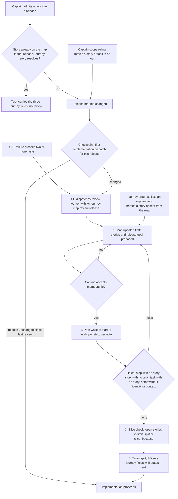

A release gains tasks one at a time and nothing checks that together they still form one complete journey; batch C part 2 of the dev2 fixes.

## Scope

Captain 2026-09-30: 「有部分關係，你稍後可以找那個 peer ，有一個新的提議是 cl 認為每個切片只能有五件事，你可以跟他交換這個問題的細節，並且看看是否可以把這個規則跟 520 結合，那個 peer 就可以專心處理 relay + spacedock review 的旅程問題。我們來解決 520 問題。」 This task covers issue #520 and the proposed "a slice holds at most five things" rule.
Evidence (qnow, 2026-09-29, issue #520): over two days the Captain ruled eight-plus tasks into one release, each filed and designed on its own scope; the journey map's release stayed at its five stories of 2026-09-23 and the shop journey had none; cross-task holes surfaced only at Captain UAT (no brand context in the owner app, no signed-in identity in the office, no task that takes a real shop live on production). On 2026-09-30 the Captain then re-cut qnow's go-live slices from a whole-journey analysis before any dev2 fix.
Five-things rule, handed over 2026-09-30 by the peer session that drafted it (Captain not yet ruled on its design): proposed in a design review of another adopter's journey, where a reviewer could not discuss a release slice whose one column mixed two actors' actions and asked for at most five things per slice so people can hold the whole slice in their head. Captain: 「我覺得每片五件事最多可以開一個 PR 回去上游，讓切 slice時有依據，等於預設就是五件事。」 and 「我想像是可能會有 r2.1, r.2.2 等切片，每一片約莫是一天到兩天的實作量」. Draft: one thing is a story in the release whose status is not `exists` (steps, acceptance criteria and tasks are not counted); default limit 5, overridable per journey by a top-level `slice_limit`; advisory, not a gate: journey-lint prints a line like the existing `long-card (advisory)`, and `references/release-slicing.md` says a slice over the limit splits into sub-slices or states why not; the handoff budget check (`lib/journey-handoff.mjs`, estimate vs appetite) does not refuse on count, because `release-slicing.md` already says story count does not establish fit and this rule is about cognitive load, not fit. Case: after a redraw that adopter's first slice still held 14 stories, 10 not yet existing, and an independent read-only review flagged it as not a clear five-step demo; the other slices held 4, 4, 2 and 2. A second peer session confirmed the case and adds: in the review the unit of "thing" was never defined ("five things, or pick a number", reason: cognitive overhead), counting one story card per thing was that session's reading, and whether stories that already exist count is open; the Captain's own sizing words are the one-to-two-days line above, and on the oversized slice: 「這幾個活動其實包含了第二角色但沒呈現」. Public-repo rule: the package and its PR state only the generic reason.
Non-goals: no new stage, gate or Spacedock change; no blocking limit on slice size; no counting of steps, tasks or acceptance criteria; no automatic writing of task fields (FO writes them with `status --set`); no version field on releases; no reader change for a task that delivers several stories (deferred, measured in the design); no default day-appetite number.

## Design

### PRFAQ

**Press release.** A release is no longer patched one task at a time. When the Captain admits a task into a release, rules a scope change, or a UAT failure crosses tasks, the release is walked end to end as one journey: the journey map is updated first, the path is walked from the person's first situation to the observable finish, and only then are tasks split. A slice also stays small enough to read at once: when a slice holds more than five stories that do not exist yet, the journey linter prints one advisory line, and the slice is split or says why it is not.

**FAQ.**

- *Does every task trigger a review?* No. A task that delivers a story already on the map, in a release whose story set has not changed, passes with one check: its `journey-story` resolves. The review runs once per batch at a single checkpoint, and only when a signal has marked the release changed since its last review.
- *Who runs it?* A fresh worker that FO dispatches with the `kc-journey-map` skill in a new `review-release` mode; the Captain decides membership. FO writes no map and no candidate. Model: the workflow default; opus only when the Captain's scope ruling is contested.
- *Is five a gate?* No. It is an advisory line, like the existing `long-card (advisory)`. `journey-handoff.mjs` does not refuse on count.
- *Does five mean one to two days?* No. Story count is a cognitive-load cue. Fit stays with the handoff's appetite-versus-estimate check, as `release-slicing.md` already says.

### Chain check (what exists, where; origin/main 2bd1bfab)

| Layer | Exists | Reused / changed |
| --- | --- | --- |
| kc-journey-map | `skills/kc-journey-map/references/release-slicing.md` (removal test, "story count does not establish fit", appetite vs estimate); `lib/journey-handoff.mjs` (checks one cut release at cut time only); `references/interrogation.md` (questions before development, not a whole-path walk); `lib/journey-lint.mjs` + `lib/lint.mjs` (`longCards`, the advisory pattern); `lib/progress.mjs` + `kc-journey-progress` (reads `journey`, `journey-release`, `journey-story`, `journey-required-tasks`, `journey-mapping-complete` from tasks) | Reuse all. New: `oversizedSlices`, `slice_limit`, `slice_because`, an `orphans` list in `journey-progress`, a `review-release` mode and reference |
| kc-dev-flow-2 | `references/sd/workflow.md` `backlog` stage and its `## FO alignment` record; no journey fields in the task template or stage text; `references/sd/workflow.md` says a deferred capability belongs on the journey map | New prose only: signals, single checkpoint, task fields, `Release review:` line |
| kc-dev-flow (v1) | `choose-work-profile`, `adopt-dev-flow`: scalar `release: <journey>/<release-id>` plus `release-readiness`, "refused unqualified" (`profile-contract-loader.py`) | Not reused: a different field pair from the one `kc-journey-progress` already reads; a release id is qualified by its journey there |
| spacedock 0.27.2 | `status --set <slug> key=value` accepts `journey`, `journey-release`, `journey-story`; `status --all-fields --json` returns them (probed 2026-09-30 in a scratch workflow under /tmp) | No change needed |
| Adopters | qnow `docs/journey/qnow-owner.yaml`, `qnow-shop.yaml` at `ddc58ea90` (`origin/next`); no file under its `docs/dev2/.spacedock-state`, active or archived, contains `journey-release` (`grep -rl`, 0 files, 2026-09-30) | Evidence below |

### The five-per-slice unit, measured on qnow (`ddc58ea90`, both journey files)

| Candidate unit | What it counts | Over five, per journey file | Over five, by release id across both files |
| --- | --- | --- | --- |
| Open stories (status is not `exists`) | work still to plan and hold in mind | owner `r3` (6) | `r3` 8, `r13` 9, `r11` 8, `r9` 6, `r17` 6 |
| All stories | done and open alike | owner `r1` (6), owner `r3` (6), shop `r1` (18 of which 17 exist) | adds `r1` (24) |
| Steps touched | activity columns a release reaches | none (largest 5) | none |
| Tasks | tasks per release | not computable: no task carries the release, and tasks exist only after the split | same |

- **Recommendation: count open stories, per journey file.** All-stories flags two releases that already shipped; steps never flag; tasks come after the slice. Open stories flags the one release a reader would want to split. What gets worse: a release that mixes many finished stories with five new ones passes although a reader still sees the finished cards.
- **Per file, not per release id across files.** The package qualifies a release by its journey (`profile-contract-loader.py`: a bare id is unique only while one journey file exists); qnow's shared ids are its own convention. What gets worse: per-file lint catches one of qnow's five across-file oversized ids (`r3`). The review reference tells the reviewer to add the counts by hand when releases in several journey files are one demo.
- **Against sizing.** qnow's own release notes tag `r3` "about S" with 8 open stories across both files and `r4` "about M" with 5 (its notes call the estimates unmeasured). Count and size do not line up, so the rule stays a load cue and is not a fit test. The Captain's "one to two days" is an appetite the handoff already records (`budget.appetite`, `user_basis`); no day number is encoded.
- **Override.** Top-level `slice_limit` (positive integer; anything else is a `invalid-slice-limit` violation, because a typo would silently read as the default, as `lintQuestionStatus` guards for statuses). Per-release `slice_because` (non-empty text) turns the advisory into `slice-size (accepted): ... because ...`.
- **Where checked.** Advisory line in `journey-lint.mjs`: `slice-size (advisory): release r3 holds 6 stories that do not exist yet (limit 5); split into sub-slices or record slice_because`. Exit code unchanged. Spike (throwaway copy of origin/main lib under /tmp): owner file printed a line of that form for `r3` and only for `r3`; the shop file and `journey.example.yaml` printed nothing; all three ended `all lints pass`.

### Release review

- **Signals.** (1) A task admitted into a release; (2) a Captain scope ruling that moves a story or task into or out of a release or changes its goal; (3) a UAT failure that crosses tasks; (4) before a batch enters implementation. Signals 1 and 2 only mark the release changed; signal 4 is the single checkpoint where a marked release is reviewed; signal 3 runs the review at once, because a cross-task hole is the design defect the review exists for.
- **Anti-ceremony.** Signal 1 costs one check when the story is already mapped in that release. A task with no release (bug, infrastructure, workflow maintenance) is outside all four signals. One review covers every change since the last, however many tasks were admitted. Nothing here adds a stage or a gate; the Captain accepts membership in the conversation or at the task's existing backlog gate.
- **Who and what.** The review worker follows a new `references/release-review.md` in kc-journey-map, in the order the issue asks: map first, path walk, then split. Output: the proposed journey edit (a PR against the map, as adopters already do); a walk table (step, actor, observable outcome, story, task or `none`, status) with the holes named; the slice count with split or reason; the task list with proposed journey fields. It reuses the removal test and constraint checks of `release-slicing.md` and the handoff assessment's `outcome.start` / `finish` / `verification`. Interrogation stays a separate mode.
- **Recording.** FO writes `Release review: <journey>/<release-id> at <journey-file commit>` or `Release review: not needed: <reason>` under the task's `## FO alignment`. It is a procedure line; no script checks it (advisory, named plainly).
- **Map first, enforced where it can be.** `journey-progress.mjs` gains `orphans`: tasks whose `journey` equals the map's journey but whose release and story are not on the map. Non-empty orphans exit 1. This would have caught #520's tasks admitted into a release the map did not hold, provided they carried the fields.

### Task fields (question 2)

- Yes: a task admitted into a release story carries scalar `journey`, `journey-release`, `journey-story`, the fields `kc-journey-progress` already reads. FO sets them with `spacedock status --set` when it approves the task at the backlog gate; the ensign never edits frontmatter. The dev2 task template shows them as optional.
- The completion declaration (`journey-required-tasks`, full stored ids; `journey-mapping-complete: true`) is written by FO on one task per story at the review's split step, only for an adopter that has opted into `journey-progress` completion. The review is the natural moment because the exhaustive list is known then. An admission that changes the list without updating the declaration reads `unverified` in the next refresh: that is the existing drift signal.
- **Known limit, deferred.** One scalar `journey-story` per task. qnow's tasks deliver several stories each (its `r3` note names two tasks for 8 open stories), so completion by story cannot be computed for them without a reader change (a story list plus per-story declarations). No qnow task carries the fields today, so there is no observed consumer; that reader change is a follow-up for the Captain to schedule, not part of this task.

### Ownership and PRs (question 4)

| Piece | Plugin | PR |
| --- | --- | --- |
| `oversizedSlices`, `slice_limit`, `slice_because`, `invalid-slice-limit`; `orphans`; `review-release` mode row and `references/release-review.md`; the sentence in `release-slicing.md` (count is load, not fit; over five splits or states why); tests; the ADR | kc-journey-map | PR 1, `feat(kc-journey-map): ...` |
| Signals, single checkpoint, `Release review:` line and journey fields in `workflow.md` backlog stage and task template; README pointer | kc-dev-flow-2 | PR 2, `feat(kc-dev-flow-2): ...`, after PR 1 merges (it names PR 1's mode) |

Two PRs, because repo CLAUDE.md scopes a feature PR to one plugin's files and release-please attributes one commit to every plugin it touches. The plugins meet only through the task field names, which `kc-journey-progress` owns; kc-dev-flow-2 pins them by string and imports no code. No kc-dev-flow change (v1 stays on its own `release` pair). No spacedock change.

### ADR

One ADR is needed, named by its ruling and short title: "a slice holds at most five stories that do not exist yet, by default, as an advisory" (`a-slice-holds-five-open-stories-by-default`). It records the Captain's ruling, the unit, the rejected units and why the rule is not a gate. FO reserves its number when it dispatches implementation (`number_guards.py reserve --kind adr`); a dry run at origin/main 2bd1bfab on 2026-09-30 printed one `ADR:` line and left the task and state checkout untouched, so the path works. The number is bound at dispatch and is not written here. PR 1 carries the ADR; the record states only the generic reason for the rule.

### Bounded existing-code check

Reused: the task-field reader, the `long-card (advisory)` pattern, `release-slicing.md`, `interrogation.md`, `journey-handoff.mjs`, `status --set`. Not reused: kc-dev-flow v1's `release` pair (other field names). New code is `oversizedSlices` (about ten lines in the spike) and `orphans`; everything else is prose. Observation that the change is needed: #520 (tasks admitted into a release the map never held; holes found only at UAT) and the qnow numbers above.

### Needs the Captain

One ruling: the unit of a "thing". Recommendation: a story whose status is not `exists`, counted per journey file. Stories that already exist do not count. The two alternatives and their qnow counts are in the table above.

### Captain-run acceptance script (after PR 1 merges; qnow `next` at or after `ddc58ea90`)

1. `node lib/journey-lint.mjs docs/journey/qnow-owner.yaml .` (from the installed kc-journey-map) prints a `slice-size (advisory)` line for `r3` and exits 0.
2. Add `slice_limit: 6` to that file: the line disappears. Restore it.
3. `spacedock status --workflow-dir docs/dev2 --set <task> journey=qnow-owner journey-release=r3 journey-story=<story-id-not-on-the-map>`, then `node lib/journey-progress.mjs docs/journey/qnow-owner.yaml --workflow-dir docs/dev2`: it lists that task under `orphans` and exits 1. Clear the fields afterwards.

## Acceptance criteria

**AC-1**: `journey-lint.mjs` prints `slice-size (advisory): release <id> holds <n> stories that do not exist yet (limit <k>); split into sub-slices or record slice_because` for a release with more than `k` stories whose status is not `exists`, counted within one journey file, default `k` 5, and its exit code is unchanged by the line.
Verified by: node tests in `lib/lint.test.mjs` (CI runs `node --test lib/*.test.mjs`): 6 open stories print the line; 5 open print none; 1 `exists` plus 5 open print none; a CLI run exits 0 with the line present. Falsifier: changing `>` to `>=` fails the 5-open case. Current evidence: spike on qnow `ddc58ea90` printed the line for owner `r3` (6) only, none for shop or `journey.example.yaml`. Limit: a per-file count misses across-file totals.

**AC-2**: A top-level `slice_limit` (positive integer) replaces the default; any other value is an `invalid-slice-limit` violation; a per-release non-empty `slice_because` turns the advisory into `slice-size (accepted): ... because ...`.
Verified by: node tests: `slice_limit: 6` silences owner `r3`; `0`, `"5"` and `2.5` each yield the violation and exit 1; a release with `slice_because` prints the accepted form and an empty `slice_because` still prints the advisory. Not yet verified: no test exists yet.

**AC-3**: The count never refuses a handoff: `journey-handoff.mjs` passes a release of more than five open stories whose assessment is otherwise valid, and `release-slicing.md` says a slice over the limit splits into sub-slices or states why, that the count is a cognitive-load cue, and that fit stays appetite versus estimate.
Verified by: a new case in `lib/journey-handoff.test.mjs` (7 open stories, valid assessment, exit 0); falsifier: adding a count refusal to the handoff fails it. Prose is read against `release-slicing.md`'s existing "story count does not establish fit" sentence. Not yet verified.

**AC-4**: `journey-progress.mjs` lists `orphans`, tasks whose `journey` equals the map's but whose release and story are not both on the map, and exits 1 when any exist.
Verified by: a pure-function test on `calculateProgress`'s neighbour with fake task rows (orphan, mapped, other-journey row ignored), plus an integration test in `lib/progress.test.mjs` that runs the real pinned `spacedock` against a scratch workflow whose task has `journey-story` absent from the map. Falsifier: reading only mapped tasks yields an empty list and fails both. Current evidence: `status --set` and `--all-fields --json` round-trip the three fields on spacedock 0.27.2 (scratch probe). Not yet verified for orphans.

**AC-5**: kc-journey-map has a `review-release` mode (SKILL.md row) and `references/release-review.md` that order the work map first, path walk, slice check, then task split, define the walk table and the four hole classes, and tell the reviewer to add counts by hand across journey files that share a demo.
Verified by: `skill-frontmatter-lint.sh` and `node --test lib/*.test.mjs` stay green; a replay: a fresh worker given only the reference and qnow's maps and task list at `cebce1173` (the 2026-09-29 regrade, before the re-cut) produces a walk that names the three holes the issue recorded (no brand context in the owner app, no signed-in identity in the office, no task that takes a real shop live). Pass or fail is the Captain's issue text. Agent-run and non-deterministic; not yet run.

**AC-6**: kc-dev-flow-2's `workflow.md` states the four signals, that signals 1 and 2 only mark a release changed, the single implementation checkpoint, the skip cases (no release; story already mapped in an unchanged release), the `Release review:` line, and that FO sets the three journey fields with `status --set` at the backlog gate; the task template shows them as optional.
Verified by: `lint-skills.py` and the existing `test_*.py` in `.github/workflows/kc-dev-flow-2-tests.yml` stay green; a scratch-workflow rehearsal in which a task naming an unmapped story is held and a task naming a mapped story is admitted with the fields set. The prose is not machine-checked, and nothing enforces the `Release review:` line. Not yet verified.

**AC-7**: The change ships as two Conventional-Commit PRs, kc-journey-map first, each touching only its own plugin (plus the ADR in PR 1), with no version edits and no mention of another adopter, its people, meetings or product.
Verified by: PR file lists; `kc-plugin-forge-sanitize-check` on each plugin; required checks `marketplace-parity.yml` and skill frontmatter lint pass; the PR titles read `feat(kc-journey-map): ...` and `feat(kc-dev-flow-2): ...`.

**AC-8**: One ADR records the slice rule and lints clean.
Verified by: `python3 <package>/scripts/adr_lint.py docs/adr --require <reserved number>` at validation, the number reserved by FO at implementation dispatch. Not yet verified.

## FO alignment

Needed at ideation: at which signals a release is re-reviewed as a whole journey (a task admitted into a release, a Captain scope ruling, a UAT failure that crosses tasks, before a batch enters implementation) and what the re-review produces; whether tasks carry `journey`, `journey-release` and `journey-story` so kc-journey-progress can compute completion; what "a slice holds at most five things" counts, where it is checked and what happens above five; which parts belong to kc-dev-flow-2 and which to kc-journey-map.
Result: the FO delegates these questions to ideation, which decides each with its source and returns any ruling that needs the Captain.
Surfaces: none
Visible change: none

## Stage Report: ideation

- DONE: Design the change for issue #520 with the five-per-slice rule: signals, task fields, unit and check, ownership (questions 1 to 4)
  `## Design` in this file: four signals with a single checkpoint and skip cases, scalar task fields with a deferred multi-story limit, open-story unit per journey file with qnow counts, two PRs with kc-journey-map first; Mermaid matches the prose.
- DONE: Check the chain first and report what exists and where
  `### Chain check` table (origin/main 2bd1bfab): kc-journey-map, kc-dev-flow-2, kc-dev-flow v1, spacedock 0.27.2 field round-trip probe, qnow files at ddc58ea90; no task in qnow's state carries `journey-release`.
- DONE: ACs with evidence plans, ADR need, what needs the Captain, Captain-run acceptance script
  `## Acceptance criteria` AC-1..AC-8; ADR named by short title with `reserve --kind adr` dry run (printed one line, state untouched); one Captain ruling (the unit); three-step script.
- DONE: AC-1 slice-size advisory line, exit unchanged
  Spike on qnow ddc58ea90 printed it for owner r3 (6 open) only, none for shop or journey.example.yaml; node tests not yet written.
- DONE: AC-2 `slice_limit`, `invalid-slice-limit`, `slice_because`
  Not yet verified; test plan names 6, 0, "5", 2.5 and the empty reason.
- DONE: AC-3 count never refuses a handoff; release-slicing.md sentence
  Not yet verified; plan is a 7-open-story handoff case that must exit 0.
- DONE: AC-4 `orphans` in journey-progress
  `status --set` and `--all-fields --json` round-trip the three fields on spacedock 0.27.2 (scratch probe); orphan logic not yet verified.
- DONE: AC-5 `review-release` mode and reference
  Not yet verified; replay at qnow cebce1173 must name the three holes the issue recorded (agent-run, non-deterministic).
- DONE: AC-6 dev2 signals, checkpoint, `Release review:` line, journey fields
  Not yet verified; prose is not machine-checked and nothing enforces the line.
- DONE: AC-7 two PRs, kc-journey-map first, scoped, sanitized
  Not yet verified; checked by PR file lists, sanitize-check and required checks.
- DONE: AC-8 one ADR lints clean
  Not yet verified; `adr_lint.py --require <reserved number>` at validation.
- DONE: `design_surfaces.py check` passes
  Installed 0.9.0 copy and origin/main copy both printed `release-review.md: design surfaces presentable`, exit 0.

### Summary

The release is re-reviewed at four signals but run once, at one implementation checkpoint, and skipped when a task delivers an already-mapped story; kc-journey-map owns the walk and the advisory `slice-size` line, kc-dev-flow-2 owns when FO asks, in two PRs. The one Captain ruling is the unit: open stories per journey file, against all stories, steps, tasks or a count across files (qnow: 1, 3, 0 and 5 releases flagged). Deferred and flagged: a task delivering several stories cannot carry a story list, no qnow task carries the fields yet, and `Release review:` is a procedure line no script checks.
